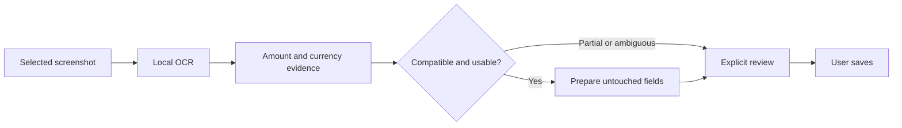

# MoneyUp remaining acceptance

The user requested every journey, with typical use of 5–10 entries per day and
screenshot receipts. Continue on `codex/effortless-moneyup-journeys`; no merge or
release. The starting source is `2d0858fc85900f8fff863aeab6aff09ee361a36e`.
The installed private book must remain intact.

## Evidence plan

| Journey | Automated evidence | Physical evidence still required |
|---|---|---|
| Authentication and privacy | AutomaticUnlockTests, DatabaseStoreOpenerTests, existing lifecycle/route interruption tests | Native Face ID/Touch ID, passcode/lockout, immediate auto-lock, app-switcher privacy |
| Onboarding and accounts | Existing onboarding/account lifecycle suites; daily story checks exact account balances | Setup controls, account creation, keyboard and back navigation |
| Log and screenshot capture | Real Vision on fictional screenshot PNGs; field/currency authority tests; native cursor/decimal checks | User's screenshots, Photos selection/cancellation, compact-screen Notes/Save, touch typing |
| History and navigation | Existing navigation/filters/chart presets, daily Repeat/Refund flow, 10,000-entry sparse review | Back/context expectations, search visibility, horizontal gestures |
| Planning and assets | Existing budget, allowance, goal, loan, investment and currency suites; daily recalculation assertions | Five-tab layout, explainability, accessible planning/asset actions |
| Settings and recovery | Profile persistence, actual encrypted export and reviewed restore ticket, lock/reopen | In-place upgrade and recovery on the owner's device, verified external backup |
| Accessibility | Native render and focus regressions in EN/zh-Hans | VoiceOver, largest Dynamic Type, contrast/motion settings, software keyboard occlusion |
| Performance | Same-machine interleaved baseline/candidate probe; daily-density and dense 10k cases; existing Release Simulator suite | Matched end-to-end oldest/current iPhone traces |

## Verified findings and changes

- The screenshot parser recognized currency markers for scoring but discarded
  currency identity. Amount suggestions could appear under an incompatible
  account currency. Explicit currency evidence now survives parsing; incompatible
  or multiple codes block automated amount fill and incompatible candidate use.
  Ambiguous symbols require explicit review. There is no conversion or automatic
  account change, and manually entered values remain protected.
- Real fast Vision output on clear English screenshots returned moderate (0.5)
  confidence. The scanner's separate 0.82 average cutoff discarded it before the
  existing field-level parser policy could accept a labeled amount. The fast gate
  now uses that same moderate-evidence policy without upgrading its confidence;
  weak amount lines and unlabelled amounts still fall through.
- A timed-out accurate pass may retain bounded fast candidates as explicit-review
  output. The authority flag survives bounding and parsing and prevents all
  automatic receipt field filling, including notes. Observed confidence is not
  falsified to represent this separate authority decision.
- Missing receipt dates are called out and the date controls are exposed. Chinese
  account-balance and transaction-reference labels are excluded from payable
  amount candidates.
- The daily story reproduced balances becoming unavailable after changing
  auto-lock. The shared profile rule now preserves financial projections across
  known nonfinancial authentication, capture-default and widget preferences.
  Unknown future fields and financial-context changes still invalidate
  conservatively. The settings/restore/reopen story passed after this fix.
- The keyboard test now waits for a rendered frame and checks insertion position,
  in addition to field identity, raw decimals, focus and safe dismissal.

## Controlled persistence comparison

Build both starting source `2d0858f` and base `a7b987b` with Swift 6.4, Release,
against the same pinned SQLCipher. Generate the existing 10,000-entry / 20-schedule
Golden fixture once. Both executables read copies of the same encrypted database
and restore the same authenticated archive. Alternate main/candidate order over
10 pairs; opening, loading and restore are measured inside each process, excluding
process launch and fixture generation. Restore counts and load checksums are
verified on every sample. This is a local diagnostic, not physical iPhone evidence.

| Median, ms | Main | Candidate |
|---|---:|---:|
| Open + close | 92.29 | 91.09 |
| Load | 278.89 | 276.99 |
| Restore | 6,297.06 | 6,125.79 |

The earlier broad CI slowdown did not reproduce in this controlled comparison.
These small differences do not establish a general speedup. Raw samples and the
standalone probe are in `review-evidence/2026-09-08/`; the probe links the existing
PerformanceFixture/PerformanceOperations/PerformanceAsync/PerformanceIntelligenceCorpus
sources and uses their checksum-verified oracle resource.

## Environment boundary

The Mac currently has Command Line Tools, no discoverable Xcode installation,
and no USB iPhone in the device inventory. Device details were requested while
independent automated work continued. Synthetic screenshots are deliberately
fictional and do not establish accuracy on the user's own screenshots. No private
book, production key, or installed app data has been opened or modified.
