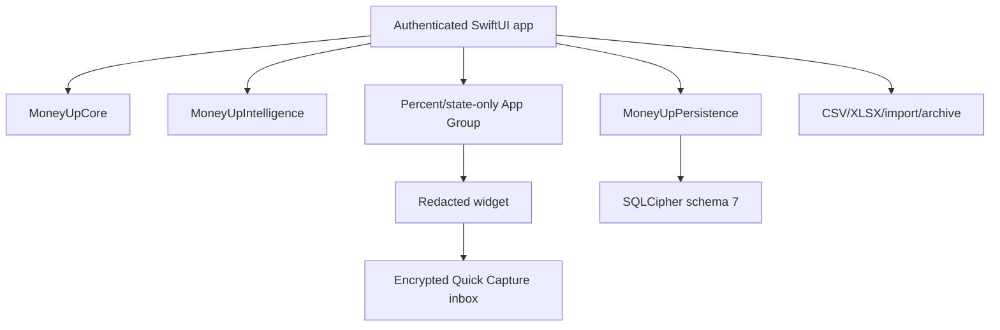

# Architecture

## System shape

The widget has two deliberately separate boundaries. Basic actions can route
to a device-only encrypted Quick Capture inbox without opening the book. The
opt-in budget-status surface reads a tiny snapshot from
`group.com.laiwenkang.MoneyUp` containing only availability/state and an
integer percentage. The shared container never receives amounts, payees,
account names, holdings, balances, transaction data, ledger identifiers, the
SQLCipher database, or its Keychain key.

`MoneyUpCore` has no UI, database, or network dependency. It uses Foundation
for domain behavior and CryptoKit only to create local import fingerprints.
Financial invariants remain independently testable, and no runtime backend is
required.

## Module boundaries

| Module | Responsibility | Source state |
|---|---|---|
| MoneyUp app | Observation-tracked state coordinator, locking, bilingual SwiftUI, local guidance and workflows | Implemented — verification pending |
| MoneyUpCore | Exact money, ledger, hierarchy, recurrence, goals, investments, reports, export rules | Implemented in source; exact-candidate core tests open |
| MoneyUpIntelligence | Pure deterministic detectors, exact evidence contracts, projections, and budget proposals; depends only on MoneyUpCore | Implemented in source; final W2 exact-SHA gate open |
| MoneyUpPersistence | SQLCipher schema/migrations, normalized encrypted indexes, atomic writes, snapshots | Implemented in source; Mac test gate open |
| Widget | Redacted actions plus opt-in percentage/state status | Implemented in source; App Group registration/signing and device matrix open |
| Portability | CSV/XLSX, mapped local import, sanitized encrypted attachments, file-backed archive lifecycle | Implemented in source; exact-candidate and physical restore/export drills open |

`BudgetTree`, `BudgetRollover`, `SavingsGoal`, and `FinancialGuidance` own the
exact plan arithmetic. `InvestmentHolding`, `TransactionFactory`, and
`NetWorthSnapshot` keep purchases, sales, repricing, FIFO metadata, and
currency-separated observations tied to the ledger. SwiftUI can render those
results, but dimensional artwork never carries a financial quantity.

## Observation and service ownership

`AppModel` is an `@MainActor @Observable` coordinator. SwiftUI receives it
through `@Environment(AppModel.self)`, so Observation tracks the properties a
view actually reads instead of broadcasting every mutation to every screen.
Async settings bindings remain explicit `Binding` closures: persistence must
complete through the serialized profile boundary before the observed profile
changes, so a direct `@Bindable` write would bypass that safety contract.

Mutable screen state is owned by injected, independently observable services:

| Service | Owned state |
|---|---|
| `LedgerService` | Accounts, journal count/currentness, and the bounded recent journal |
| `PlanningService` | Budget nodes, schedules, and savings goals |
| `AssetsService` | Holdings, dated rates, and net-worth snapshots |
| `PortabilityService` | Recovery and quarantine presentation state |
| `CaptureService` | Draft, receipt metadata, locked-capture count, and Log routing |
| `IntelligenceService` | Findings, refresh/cancellation state, indexed capture suggestions, projections, and reviewed budget proposals |

The services do not own SQLCipher connections and cannot open an independent
transaction. `AppModel` still coordinates locking, generation checks,
cancellation, cross-service transitions, and exactly one store transaction for
each operation that was atomic before the split. The deterministic clock,
quarantine preservation, and rollback ordering remain at their prior seams.

Whole-profile settings writes use a FIFO serializer. Each queued mutation
re-reads the latest committed profile after it acquires the lane, persists only
its local candidate, and publishes only after the write succeeds. Rapid input
therefore converges on the last choice, while a failed mutation cannot replace
or roll back an unrelated committed setting.

Repository structure is a CI invariant. `Scripts/validate_swift_structure.py`
checks every Swift file under `App/` and `Sources/`: files are limited to 1,200
lines, type and extension bodies to 600 lines, and function bodies to 80 lines.
The body-line convention excludes a declaration's signature and outer braces
but includes blank and comment lines inside the body. The release validator
also requires the explicit CI step, so removing or bypassing the gate fails
release readiness.

## State and lock lifecycle

The application moves between launching, locked, onboarding, ready, and failed
states. The inactive phase applies an opaque privacy cover immediately. When
the configured timeout expires, the app flushes the encrypted Log draft,
closes the actor-isolated store, clears decoded records and caches, and returns
to the locked state. Receipt bytes never enter a draft.

On unlock, Keychain enforces local user presence before returning the
this-device-only SQLCipher key. Normal startup loads compact non-journal state,
exact balances/reference counts, budget-attribution index health, and at most a
bounded recent-activity page; it does not decode or retain the complete journal
or a healthy attribution history. An indexed mismatch triggers the exact
historical validator and fails budget projection closed. Malformed or orphaned
rows are quarantined from calculations while their encrypted raw records remain
available to backup/repair paths.

Saving, editing, deleting, importing, reconciling, posting a schedule, changing
lifecycle state, retaining an attachment, or moving a goal uses one store
transaction for all affected records. The operation either commits completely
or rolls back completely. The six-second Undo is offered only after a committed
save and reverses the same derived effects once.

## Intelligence boundary

`MoneyUpIntelligence` has no SwiftUI, SQLCipher, Keychain, network, logging, or
locale dependency. Detectors consume normalized `Sendable` values and exact
`Decimal` money, and emit stable localization keys, rule IDs, sample sizes,
confidence classes, exact figures, and bounded routes. The app localizes those
contracts only when rendering, so identical inputs produce byte-stable findings
across English and Simplified Chinese.

Routine payee affinity and detector reads use schema-7 indexes and decode zero
journal payloads. Observation queries are capped at 5,000 rows. A user-triggered
History review decodes only the requested entry IDs and caps the route at 100.
Recurrence findings can prefill an editable schedule but never save it;
budget suggestions present a before/after diff and apply selected changes in one
transaction with one-action atomic undo. Projections keep actuals, confirmed
remaining schedules, and flexible burn rate separate for each currency and
never invent FX or substitute zero for missing evidence.

The non-sensitive System/English/Simplified Chinese preference is stored in the
reviewed App Group defaults so app and widget agree. It is deliberately separate
from the financial profile, reporting time zone, stored text, and parsing rules.

## Ledger and SQLCipher schema 7

Normal views do not create postings directly. `TransactionFactory` creates
balanced expense, income, transfer, foreign-exchange, refund, reconciliation,
split, investment purchase/sale, and valuation entries. `JournalEntry`
validates each currency independently at initialization and decoding, and
retains originating calendar/time-zone facts plus a stable local-day key.

Schema 7 retains deterministic encrypted record payloads and the normalized
encrypted support tables. It extends schema 6 with derived local-intelligence
facts while retaining constant-size totals and historical budget attribution:

| Table/index | Purpose |
|---|---|
| `journal_entry_index` | Chronological identity, source fingerprint, stable day/range lookup, and a semantic budget-integrity fingerprint without decoding every payload |
| `journal_posting_index` | Account/category/currency posting events for reports, Calendar, lifecycle counts, and bounded scans |
| `journal_balance` | Exact materialized balance per account/currency |
| `receipt_attachment_index` | Entry relationship, MIME type, byte count, and creation time without loading the encrypted image payload |
| `store_metrics` | Trigger-maintained exact record/payload/identity totals used to enforce the portable-recovery envelope in O(1) memory |
| `budget_attribution_entry_index` | Stable historical budget day, entry timestamp, and matching semantic integrity fingerprint without attribution JSON decode |
| `budget_attribution_posting_index` | Historical category/currency/amount postings used by bounded rollover queries |
| `intelligence_control` | Transactional enabled/disabled state for derived intelligence maintenance |
| `ledger_account_intelligence_index` | Minimal account kind/currency/system-role/archive classification |
| `journal_intelligence_source_index` | Normalized payee key and entry kind linked to the journal index |
| `payee_affinity_index` | Full-book category frequency/recency aggregates for bounded Quick Log suggestions |

Routine writes apply exact `-old + new` posting deltas to compact balance rows
inside the same transaction. A full rebuild is reserved for migration,
restore, or explicit repair. History uses stable keyset pages. Calendar and
reports request bounded posting events for the relevant window. Export,
archive, and whole-book lifecycle work page on demand rather than turning the
recent cache into an accidental full journal.

Schema-1/2 books migrate by decoding each legacy journal payload once to build
the normalized indexes without changing the original payload, timestamp, or
identifier. Later migrations add receipt metadata, exact store metrics, and
budget-attribution projections without rewriting valid payloads. The 6-to-7
migration decodes only metadata that schema 6 did not normalize (payee, kind,
and account classification) inside the migration transaction, then builds the
derived indexes without changing payload bytes, hashes, IDs, or timestamps.
Raw malformed rows remain quarantined instead of blocking the readable book.

## Planning and investment records

Budget rollover has an explicit activation day and uses half-open Gregorian
reporting periods, so enabling it never retroactively invents carry-forward.
The first healthy indexed replay in a reporting month persists an authoritative
opening-carry checkpoint. Later unlocks query only the bounded range since the
latest checkpoint; backdated edits explicitly recompute affected checkpoints.
Savings and sinking goals retain dated contributions, withdrawals, manual or
automatic resets, archive state, target date, and reporting time zone.

Each connected holding owns a hidden position account. Purchases move cash to
the position, sales move proceeds back, and repricing balances valuation
changes against a hidden investment result account. Holdings are therefore not
added on top of ledger net worth. FIFO lots/disposals are deterministic
bookkeeping metadata, and append-only snapshots freeze totals separately by
currency.

## Portability boundary

CSV and native XLSX are explicit readable exports. Both retain stable entry,
posting, account, and hierarchy identifiers; exact decimals; currencies;
timestamps; origin-day context; and account metadata. CSV neutralizes formula
prefixes in user text. XLSX uses inline-string cells for user text and numeric
cells for valid financial values. Neither format includes receipt bytes.

Import is local, preview-first, row-aware, duplicate-detecting, and atomic.
Unknown CSV/TSV layouts can be mapped column by column. Full-fidelity recovery
uses an authenticated `.moneyup` archive derived from a user-held password.
Version 2 writes fixed metadata plus independently authenticated 1 MiB chunks
directly from a SQL cursor to a file; the header, chunk index, length, and
declared chunk count reject truncation, append, duplication, and reordering.
Current writes enforce a 100,000-record/512 MB stored-payload envelope, while
legacy version-1 archives remain readable within their compatibility limit.
Attachments, user rates, goals, snapshots, and quarantined encrypted raw
records remain in the archive. Restore streams into an isolated SQLCipher store
and then one live transaction; wrong password, tampering, cancellation, future
schema, or failure leaves or restores the prior book.

The Data inventory is a separate metadata-only JSON manifest for upgrade and
restore reconciliation. Every durable collection count comes from one
actor-isolated, payload-free SQLCipher count snapshot. Already-decoded holdings
and goals supply nested lot, disposal, price-point, correction, movement, and
reset counts; a completeness flag compares their top-level totals with the raw
store counts. The manifest never loads or contains journal payloads, receipt
bytes, user-authored identifiers, names, amounts, currencies, notes, or balances.

## Evidence boundary

W1 is merged and its exact merged-main CI passed. This architecture also
includes the source-integrated W2 candidate; it is not a claim that final W2
PR/merged-main CI, 10,000-entry physical budgets, upgrade/restore on iPhones, or
TestFlight/App Review passed. Those gates remain tracked in
[Golden PRD traceability](GOLDEN_TRACEABILITY.md).
