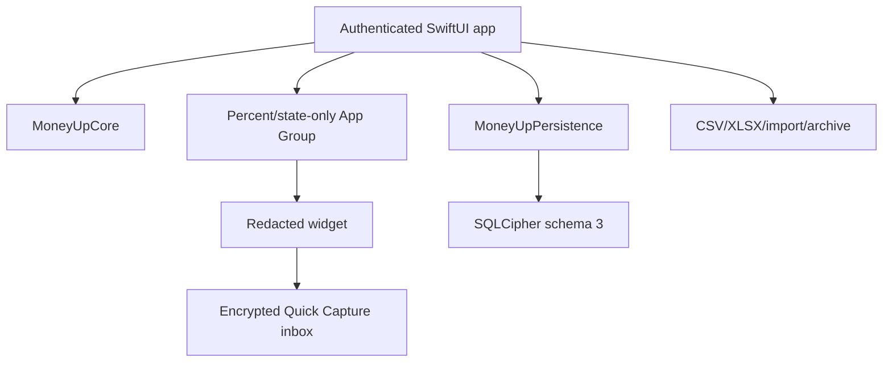

# Architecture

## System shape

The widget has two deliberately separate boundaries. Basic actions can route
to a device-only encrypted Quick Capture inbox without opening the book. The
opt-in budget-status surface reads a tiny snapshot from
`group.com.laiwenkang.MoneyUp` containing only availability/state and an
integer percentage. The shared container never receives amounts, payees,
account names, holdings, balances, transaction data, ledger identifiers, the
SQLCipher database, or its Keychain key.

`MoneyUpCore` has no UI, database, network, or Apple-framework dependency
beyond Foundation. Financial invariants remain independently testable, and no
runtime backend is required.

## Module boundaries

| Module | Responsibility | 0.6.0 source state |
|---|---|---|
| MoneyUp app | State machine, locking, bilingual SwiftUI, local guidance and workflows | Implemented in source; exact-candidate app tests open |
| MoneyUpCore | Exact money, ledger, hierarchy, recurrence, goals, investments, reports, export rules | Implemented in source; exact-candidate core tests open |
| MoneyUpPersistence | SQLCipher schema/migrations, normalized encrypted indexes, atomic writes, snapshots | Implemented in source; Mac test gate open |
| Widget | Redacted actions plus opt-in percentage/state status | Implemented in source; App Group registration/signing and device matrix open |
| Portability | CSV/XLSX, mapped local import, encrypted attachment/archive lifecycle | Implemented in source; physical restore/export drills open |

`BudgetTree`, `BudgetRollover`, `SavingsGoal`, and `FinancialGuidance` own the
exact plan arithmetic. `InvestmentHolding`, `TransactionFactory`, and
`NetWorthSnapshot` keep purchases, sales, repricing, FIFO metadata, and
currency-separated observations tied to the ledger. SwiftUI can render those
results, but dimensional artwork never carries a financial quantity.

## State and lock lifecycle

The application moves between launching, locked, onboarding, ready, and failed
states. The inactive phase applies an opaque privacy cover immediately. When
the configured timeout expires, the app flushes the encrypted Log draft,
closes the actor-isolated store, clears decoded records and caches, and returns
to the locked state. Receipt bytes never enter a draft.

On unlock, Keychain enforces local user presence before returning the
this-device-only SQLCipher key. Normal startup loads non-journal records, exact
compact balances/reference counts, and at most a bounded recent-activity page;
it does not decode or retain the complete journal. Malformed or orphaned rows
are quarantined from calculations while their encrypted raw records remain
available to backup/repair paths.

Saving, editing, deleting, importing, reconciling, posting a schedule, changing
lifecycle state, retaining an attachment, or moving a goal uses one store
transaction for all affected records. The operation either commits completely
or rolls back completely. The six-second Undo is offered only after a committed
save and reverses the same derived effects once.

## Ledger and SQLCipher schema 3

Normal views do not create postings directly. `TransactionFactory` creates
balanced expense, income, transfer, foreign-exchange, refund, reconciliation,
split, investment purchase/sale, and valuation entries. `JournalEntry`
validates each currency independently at initialization and decoding, and
retains originating calendar/time-zone facts plus a stable local-day key.

Schema 3 retains deterministic encrypted record payloads and adds normalized
encrypted support tables:

| Table/index | Purpose |
|---|---|
| `journal_entry_index` | Chronological identity, source fingerprint, and day/range lookup without decoding every payload |
| `journal_posting_index` | Account/category/currency posting events for reports, Calendar, lifecycle counts, and bounded scans |
| `journal_balance` | Exact materialized balance per account/currency |

Routine writes apply exact `-old + new` posting deltas to compact balance rows
inside the same transaction. A full rebuild is reserved for migration,
restore, or explicit repair. History uses stable keyset pages. Calendar and
reports request bounded posting events for the relevant window. Export,
archive, and whole-book lifecycle work page on demand rather than turning the
recent cache into an accidental full journal.

Schema-1/2 books migrate by decoding each legacy journal payload once to build
the normalized indexes without changing the original payload, timestamp, or
identifier. Raw malformed rows remain quarantined instead of blocking the
readable book.

## Planning and investment records

Budget rollover has an explicit activation day and uses half-open Gregorian
reporting periods, so enabling it never retroactively invents carry-forward.
Savings and sinking goals retain dated contributions, withdrawals, manual or
automatic resets, archive state, target date, and reporting time zone.

Each connected holding owns a hidden position account. Purchases move cash to
the position, sales move proceeds back, and repricing balances valuation
changes against a hidden investment result account. Holdings are therefore not
added on top of ledger net worth. FIFO lots/disposals are deterministic
bookkeeping metadata, and append-only snapshots freeze totals separately by
currency.

## Portability boundary

CSV and native XLSX are explicit readable exports. Both retain stable entry,
posting, account, and hierarchy identifiers; exact decimals; currencies;
timestamps; origin-day context; and account metadata. CSV neutralizes formula
prefixes in user text. XLSX uses inline-string cells for user text and numeric
cells for valid financial values. Neither format includes receipt bytes.

Import is local, preview-first, row-aware, duplicate-detecting, and atomic.
Unknown CSV/TSV layouts can be mapped column by column. Full-fidelity recovery
uses an authenticated `.moneyup` archive derived from a user-held password;
attachments, user rates, goals, snapshots, and encrypted raw records remain in
that archive. Restore validates first and leaves the current book untouched on
wrong password, tampering, cancellation, future schema, or failure.

## Evidence boundary

This architecture describes the source-integrated 0.6.0 candidate. It is not a
claim that Swift/XCTest compiled on the exact merge, that the 10,000-entry
physical budgets passed, that upgrade/restore succeeded on iPhones, or that
TestFlight/App Review accepted a binary. Those gates remain tracked in
[Golden PRD traceability](GOLDEN_TRACEABILITY.md).
