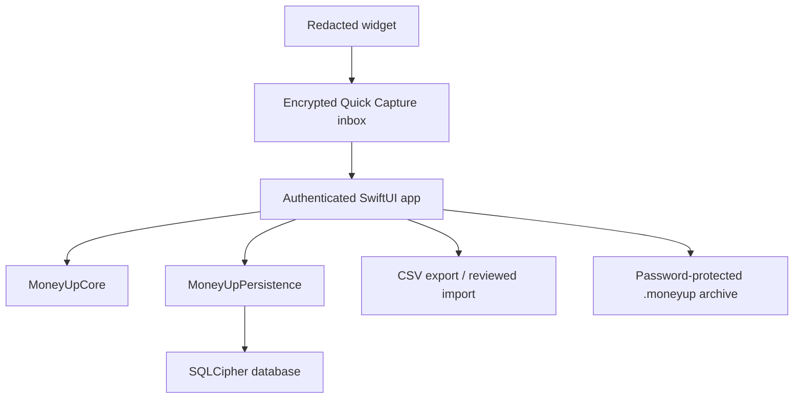

# Architecture

## System shape

The widget owns no financial snapshot. On cold launch, a deterministic routing
window processes its basic actions before protected database startup. They deep-link to a
separate device-only encrypted capture inbox containing no balances or database
key; captures move into SQLCipher after the next authenticated unlock.
`MoneyUpCore` has no UI, database, network, or Apple-framework
dependency beyond Foundation, so financial invariants remain independently
testable.

## Module boundaries

| Module | Responsibility | Founders Beta 0.5.0 |
|---|---|---|
| MoneyUp app | State machine, lock lifecycle, bilingual SwiftUI, local insights | Implemented |
| MoneyUpCore | Money, ledger, hierarchy, recurrence, holdings, export rules | Implemented |
| MoneyUpPersistence | SQLCipher schema, record encoding, migrations, atomic batches | Implemented |
| Widget | Redacted presentation and authenticated quick-log deep links | Implemented |
| Portability | Readable enriched CSV plus previewable local CSV/Qianji import | Implemented |
| Portable recovery | Authenticated encrypted archive and transactional restore | Implemented |

`BudgetTree.swift` owns purpose inheritance and non-overlapping allocation
selection. `FinancialGuidance.swift` owns the exact, independently tested
arithmetic for Flexible Today and read-only budget scenarios. SwiftUI may render those results
with flat charts and diagrams, but generated dimensional artwork never carries
a financial quantity. Insights chart selections create a `HistoryPreset` and
reuse the same `HistoryQuery` filter path as manual filtering.

## State and lock lifecycle

The application moves between launching, locked, onboarding, ready, and failed
states. Only `ready` retains decoded records. The inactive phase applies an
opaque cover immediately; the configurable auto-lock timer then closes the
actor-isolated database and clears decoded arrays. If Log contains an unfinished transaction, its latest text fields and
selections are flushed to SQLCipher first; receipt images are never retained.
Saving a transaction atomically commits the journal entry and removes its draft;
the cleared form may subsequently retain only useful encrypted defaults.
The inactive phase overlays an opaque privacy cover so the app-switcher snapshot
cannot capture balances or transactions.

On unlock, Keychain enforces local user presence before returning the SQLCipher
key. The app loads valid rows, quarantines malformed or orphaned rows from
calculations while preserving them in raw backups, validates the usable book,
then exposes ready state. It never silently erases an interrupted or damaged
book.

## Ledger and persistence

Normal views do not create postings directly. `TransactionFactory` creates
balanced expense, income, transfer, foreign-exchange, refund, and reconciliation
entries. `JournalEntry` validates each currency independently at initialization
and again during decoding.

The store encodes each record as deterministic JSON inside an encrypted SQLite
table. Related setup records are committed with `BEGIN IMMEDIATE` and either all
persist or all roll back. The app uses the profile record as the completed-book
marker when recovering an interrupted legacy onboarding.

## Spreadsheet boundary

CSV is an explicit, readable export. It retains stable entry, posting, and
account identifiers, exact decimals, currency codes, timestamps, account names,
types, and hierarchy identifiers. Potential spreadsheet-formula prefixes in
user text are neutralized. The app warns that the resulting file is unencrypted
before opening the system file picker.

CSV is not the database. Import is a reviewed local boundary with row-level
issues, explicit fallback mappings, duplicate fingerprints, and an atomic
commit. Full-fidelity recovery uses an authenticated `.moneyup` archive derived
from a user password; restore validates first and rolls the current snapshot
back if loading fails.
