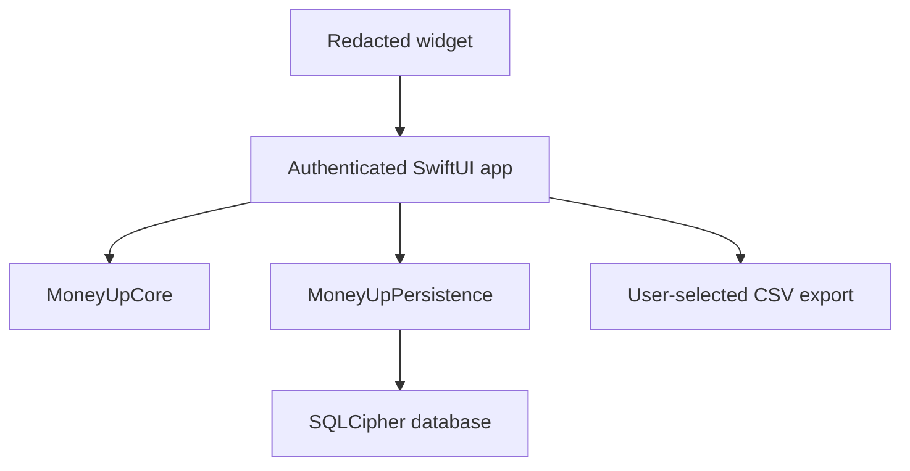

# Architecture

## System shape

The widget owns no financial snapshot and deep-links only to the authenticated
quick-log flow. `MoneyUpCore` has no UI, database, network, or Apple-framework
dependency beyond Foundation, so financial invariants remain independently
testable.

## Module boundaries

| Module | Responsibility | Founders Beta 0.4.0 |
|---|---|---|
| MoneyUp app | State machine, lock lifecycle, bilingual SwiftUI, local insights | Implemented |
| MoneyUpCore | Money, ledger, hierarchy, recurrence, holdings, export rules | Implemented |
| MoneyUpPersistence | SQLCipher schema, record encoding, migrations, atomic batches | Implemented |
| Widget | Redacted presentation and authenticated quick-log deep links | Implemented |
| Portability | Readable enriched CSV | Implemented |
| Portable recovery | Encrypted archive and transactional restore | Planned |

## State and lock lifecycle

The application moves between launching, locked, onboarding, ready, and failed
states. Only `ready` retains decoded records. Entering the background closes the
actor-isolated database and clears all decoded arrays before showing the locked
screen. If Log contains an unfinished transaction, its latest text fields and
selections are flushed to SQLCipher first; receipt images are never retained.
Saving a transaction atomically commits the journal entry and removes its draft;
the cleared form may subsequently retain only useful encrypted defaults.
The inactive phase overlays an opaque privacy cover so the app-switcher snapshot
cannot capture balances or transactions.

On unlock, Keychain enforces local user presence before returning the SQLCipher
key. The app loads records, validates cross-record references and the complete
budget tree, then exposes ready state. A failed integrity check does not mutate
or repair data automatically.

## Ledger and persistence

Normal views do not create postings directly. `TransactionFactory` creates
balanced expense, income, transfer, foreign-exchange, refund, and reconciliation
entries. `JournalEntry` validates each currency independently at initialization
and again during decoding.

The store encodes each record as deterministic JSON inside an encrypted SQLite
table. Related setup records are committed with `BEGIN IMMEDIATE` and either all
persist or all roll back. The app uses the profile record as the completed-book
marker when recovering an interrupted legacy onboarding.

## Spreadsheet boundary

CSV is an explicit, readable export. It retains stable entry, posting, and
account identifiers, exact decimals, currency codes, timestamps, account names,
types, and hierarchy identifiers. Potential spreadsheet-formula prefixes in
user text are neutralized. The app warns that the resulting file is unencrypted
before opening the system file picker.

CSV is not the database and is not accepted as an automatic source of truth.
Portable restore remains blocked on a versioned authenticated archive, recovery
secret, validation preview, and rollback tests.
