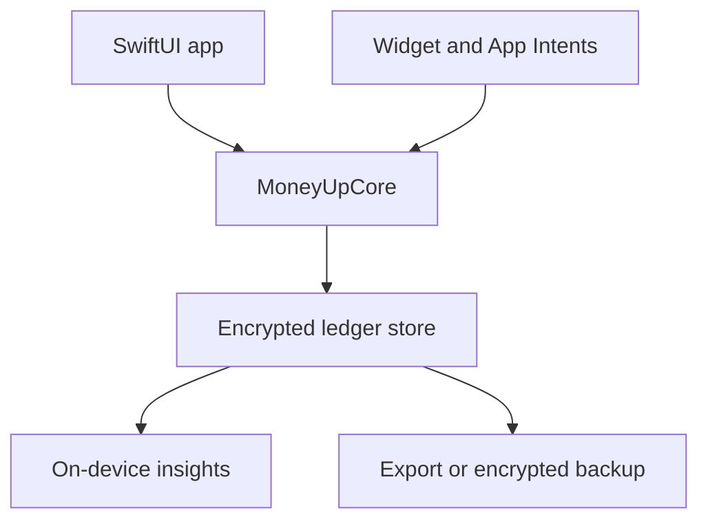

# Architecture

## System shape

`MoneyUpCore` has no UI, database, network, or Apple-framework dependency beyond
Foundation. This keeps the financial rules independently testable and prevents
view code from bypassing invariants.

## Module boundaries

| Module | Responsibility | Status |
|---|---|---|
| MoneyUp app | Navigation, accessible bilingual UI, composition | Shell implemented |
| MoneyUpCore | Money, ledger, hierarchy, deterministic export rules | Implemented |
| Persistence | SQLCipher schema, transactions, migrations, repositories | Next |
| Security | Keychain key lifecycle, local authentication, app locking | Next |
| Planning | Periods, allocations, rollover, recurring forecasts | Planned |
| Insights | Local aggregates, safe-to-spend, anomaly and trend rules | Planned |
| Widget | Minimal privacy-scoped snapshots and App Intents | Planned |
| Portability | CSV/XLSX, encrypted archive, validated restore | CSV encoder started |

## Dependency direction

- UI depends on domain protocols and values.
- Persistence implements domain repository protocols; the domain never imports
  SQLCipher.
- Widgets receive a deliberately minimal, redacted snapshot rather than broad
  access to the entire financial database whenever practical.
- Export reads immutable domain snapshots. It cannot mutate the ledger.
- Network adapters are optional leaf modules. Domain behavior never requires a
  network connection.

## Persistence decision

SwiftData is convenient but does not itself provide the application-controlled
full-database encryption required by MoneyUp's privacy promise. The planned
store is SQLite encrypted with SQLCipher. A random database key is retained in
Keychain behind local user-presence controls.

The integration must be proved with tests for incorrect keys, locked devices,
database migration, interrupted writes, and backup restoration before the app
accepts real records.

## Spreadsheet decision

MoneyUp will expose two distinct artifacts:

1. **Readable export:** multiple normalized CSV files first, XLSX later. This is
   intentionally plaintext and requires an explicit warning.
2. **Restorable archive:** a versioned, authenticated, encrypted `.moneyup`
   package containing records and a manifest.

Live two-way spreadsheet synchronization is excluded from the initial design
because arbitrary cell edits cannot reliably preserve balanced transactions,
identifiers, migrations, and conflict semantics.
