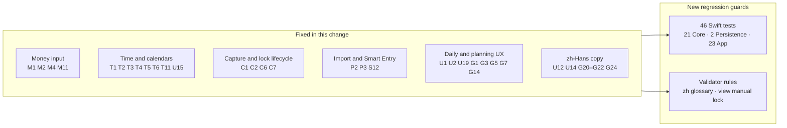
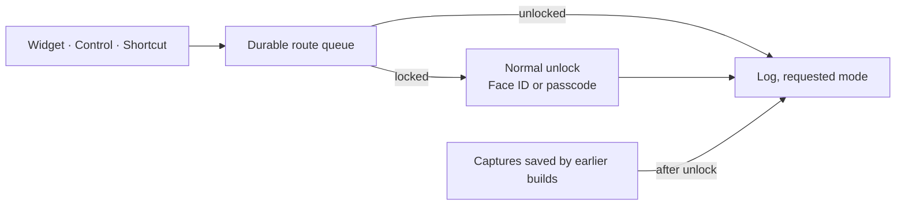
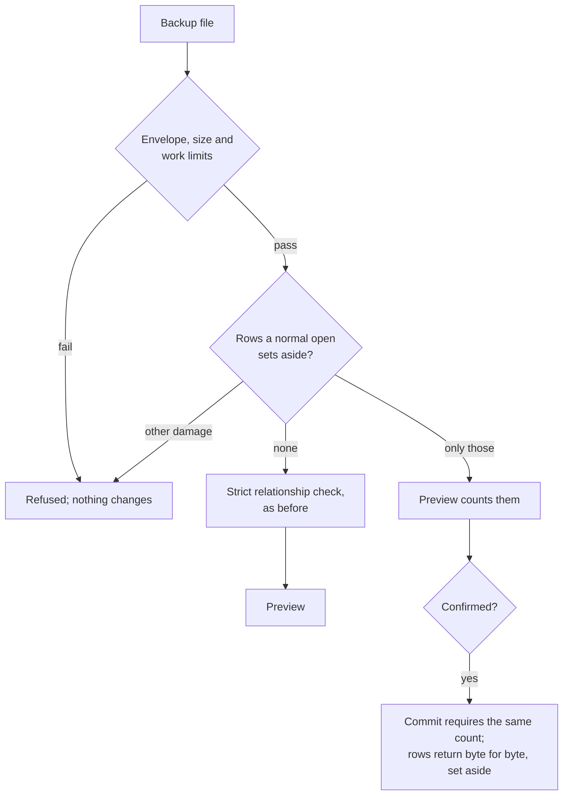

# Full-app audit of 0.7.2 (1074.1) — 25 September 2026

Audited: `main` at `50e4d92`, the source of TestFlight 0.7.2 (1074.1).
Scope: money correctness, time and calendars, persistence and security,
model concurrency and lifecycle, import and text parsing, daily UX, planning
UX, accessibility, and Simplified Chinese copy. Each finding cites file and
line at `50e4d92`, a reproduction (scratch program, test or the shipped
0.7.2 screenshots in `docs/app-store/0.7.2`), and a proposed fix.

**Totals: 148 rated findings** — 1 Critical, 22 High, 64 Medium, 61 Low
("Med-High" counts as Medium, "Low-Med" as Low) — plus 3 from a visual
review of the shipped screenshots. This change fixes **36** of the 148 fully
or partly (the Critical, 11 of the 22 High, and 24 Medium or Low that share
the same code paths) and all 3 visual items; the stacked S1 change below
brings that to **37** (12 of the 22 High). Each **Deferred** item names the
decision or evidence it still needs.

## Owner decision: one Log for widgets

The owner asked for widget logging not to be a separate place. Until now a
widget, Control Center or Shortcut tap made while MoneyUp was locked opened
Locked Quick Capture, a reduced form whose entries waited in a side inbox
until an unlock promoted them into Log. That form, its two switches ("Allow
Quick Capture while locked", "Show favourites while locked") and the
favourite labels kept for it are gone.

- A tap while locked shows the normal lock screen, then opens the one Log in
  the requested mode, with favourites, accounts and categories. If the app
  closes before the unlock, the tap stays queued and opens Log next time.
- Nothing is lost on upgrade: captures an earlier build saved while locked
  are still promoted into Log after unlock, and backups and restores keep
  handling them as before. Favourite labels an earlier build kept for the
  locked screen are deleted when a book opens.
- Validators now state the rule: a locked app shows only the unlock screen
  (RootView), and quick-action ingress never writes or replays the old inbox.
- UI journeys: `-MoneyUpUITestReset` also clears widget taps an earlier
  journey left queued, so journeys no longer depend on their order.

## S1: restoring a book with damaged records

A book can hold rows the normal open sets aside: a row that no longer
decodes, an alias under a non-canonical key, or a transaction whose category
is gone. Backups keep those rows byte for byte, and cloud said "Encrypted
backup uploaded", but restore refused the whole archive. The only backup of
such a book could not come back.

- A row may be set aside only in a collection the normal open reads with
  recovery, and only for a failed domain decode or a non-canonical key. The
  profile, entry revisions, cloud identity, pending captures and lifecycle
  audits stay all or nothing. So do rows that decode but break an identity
  rule, such as two rates for the same pair and day.
- Envelope, size and nested-work limits never relax, so a crafted row can't
  use this path. A restore without a reviewed ticket stays all or nothing.
- The confirmation is binding. The commit reloads the book and requires
  exactly the count the preview showed; any other count leaves the live book
  unchanged. A book with no damage still passes the strict relationship
  check.
- Key-cliff recovery (a lost device key) uses the same path. Its manifest
  records the confirmed count, so a resumed install requires it too.
  Manifests written before this change resume all or nothing.
- The restore keeps a malformed Log draft byte for byte and counts it; the
  next normal open removes it, as before.
- Cloud Backup now shows how many records needing attention are in the
  uploaded backup. The restore preview also shows the count and explains
  that those records come back as they are.
- Still refused, as before: a row whose nested lists can't be read or exceed
  restore work limits, and a lowercase alias next to its canonical key.
  Their work or identity can't be bounded. The app never writes such rows,
  so they would need crafted data or a new bug.

## How the fixes were verified

| Layer | Evidence |
|---|---|
| Core, Persistence, Intelligence | Full `swift test` on Linux (Swift 6.1.2, SQLCipher 4.5.6): **527 XCTest + 53 Swift Testing, 0 failures**. Each new Core and Persistence regression test was mutation-checked: with its fix reverted, it fails. |
| App target | 23 new tests in `Tests/MoneyUpAppTests/Audit1074RegressionTests.swift`; they run in macOS CI (`ios-build`). |
| Repository gates | The seven source validators (`Scripts/validate_*.py` except the built-bundle and cloud-release gates, which need artifacts) pass; `Scripts/tests/test_validate_architecture_fitness.py` passes 58/58, including a new case for the view lock rule, which was also mutation-checked. |
| SwiftUI depth ceiling | No new modifier layers in screen bodies. The End-schedule confirmation reuses the existing dialog, and new UI lives in concrete views (`CalendarMonthLayout`, `ReportingDaySelector`). |

Test kinds covered: positive and negative paths; boundaries (DST at midnight
and at 01:00, leap years, the skipped Samoa day, minor units 0–8, 40-digit
pastes); randomized stress (240- and 600-entry travel books compared with a
reference algorithm); reset and interruption (a restore paused at
`.beforeRestoreCommit` while the app goes inactive, legacy records written
by the audited build); interactions and cross-feature paths (capture
promotion versus a live Log form, category merge versus a stale form versus
backup/restore validation, loans versus ordinary transfers); concurrency
(deferred lock versus a lifecycle mutation).

## Findings and status

`Fixed` = fixed and covered by a named test; `Partly` = the named part is
fixed; `Deferred` = not changed here, with the reason.

### Time, calendars and budgets (T)

| ID | Sev | Finding | Status |
|---|---|---|---|
| T1 | Critical | A schedule resolved in another zone (or after a tzdata update) no longer matched its stored anchors, so it failed to decode, stopped checkpoints and made every later backup unrestorable. | **Fixed**: resolution uses the series' own zone; anchored validation tolerates zone-rule revisions (±36 h, below half the shortest interval). Six Core tests, including a record written by the audited build. |
| T2 | High | In-memory budget replay and `budgetAffectedMonth` used `occurredAt`; the SQL replay and reports use the origin day, so carries went stale or double-counted. | **Partly**: both now use the origin day (App tests: legacy row near midnight; 240-entry randomized equivalence with the indexed replay). Deferred: legacy rows that get an attribution still use the reporting zone, a policy pinned by `BudgetRolloverTests`; aligning it needs an index migration. |
| T3 | Medium | A valid negative effective limit (full-balance deficit) showed an arithmetic error on Plan, Today and pinned rows. | **Fixed**: over plan (ratio 2), no diagnostic. The existing `testNegativeBudgetLimitIsUnavailable` asserted the old error and is replaced by `testNegativeBudgetLimitIsOverPlanNotAnError`. |
| T4 | Medium | Deleting an unused category that carried rollover failed every month (`invalidCarryMapping`). | **Fixed** (Core test). |
| T5 | Medium | Day counts from a 01:00 `startOfDay` undercounted by one and threw on the month's last day (no safe-to-spend). Weekly schedules missed occurrences. | **Fixed**: civil-day arithmetic (`FinancialPeriodBoundary.civilDayDistance`). Five Core tests. |
| T6 | Medium | Flexible Today reserved at most one overdue occurrence, possibly from a prior month. | **Fixed** (Core test). |
| T7 | Medium | An edit made while the device clock ran ahead recorded a future budget revision. | Deferred: needs a clock-skew policy for revisions. |
| T8 | Medium | A `limit: nil` override silently drops or forgives the carry. | Deferred: product decision on carry semantics. |
| T9 | Low | The hero can show a negative "per day" figure. | Deferred. |
| T10 | Low | Month-to-date comparison uses elapsed seconds, so it is skewed across DST. | Deferred. |
| T11 | Low | Month stepping from a 01:00 month start drifted off normalized keys and threw `invalidMonth`. | **Fixed** (two Core tests: rollover replay and trend months). |
| T12–T16 | Low | Recurrence detection month-end drift and median/MAD confidence; future-month preview carry; pace marker DST offset; a latent device-zone trap. | Deferred. |

### Money and investments (M)

| ID | Sev | Finding | Status |
|---|---|---|---|
| M1 | High | "25.000" in an IDR/VND/JPY account, or "1.000" pasted on a German-region phone, was read as a decimal and saved 1/1000 of the amount; the Saved banner echoed the typed text, so nothing looked wrong. | **Fixed**: `moneyAmount(from:currency:)` refuses text written past the currency's minor units (Quick Log, splits, prepaid funding, transaction edit, balances, scheduled bills, goals, loans). Every field refuses a three-digit tail where "." groups thousands. Legacy precision stays editable while unchanged. The Saved banner shows the posted amount. App test covers eight locales and scales 0–8. |
| M2 | Medium | A tiny foreign balance rounded to 0 and failed the whole net-worth estimate and snapshot. | **Fixed**: estimates may round to zero; postings never do (Core test). |
| M3 | Medium | Unit prices must fit currency decimals ($12.3456 rejected). | Deferred: needs a price-precision model. |
| M4 | Medium | An overpaid loan (reachable by an ordinary transfer) broke the summary, blocked interest-only payments and could not be finished. | **Fixed**: Core summary, App payment and finish guards, and the Finish button (Core and App tests). |
| M5–M10 | Medium/Low | FIFO history after corrections; per-disposal basis rounding; Decimal→Double display paths; locale-digit prefill; legacy residue reconciliation; card-rate rounding. | Deferred. |
| M11 | Low | Estimated valuation built FX evidence without `quotedRate`. | **Fixed** with M2. |
| M12–M15 | Low | Favourite amount precision; split error wording; full-width and U+2212 input; regex compiled per parse. | Deferred. |

### Persistence and security (S)

| ID | Sev | Finding | Status |
|---|---|---|---|
| S1 | High | A book with any quarantined row still backs up, and the cloud reports "Backed up", but restore rejects the archive as a whole. | Fixed in the stacked S1 change: a confirmed recovering restore (see "S1: restoring a book with damaged records"), key-cliff included; Cloud Backup states the count. The C2 fix removes one common cause. `RecoveringRestoreTests`. |
| S2–S11, S13–S15 | Medium/Low | Key-cliff detection while open; profile field loss across builds; auto-lock while suspended; KDF strength and versioning; residual temp files; locked favourite disclosure; Keychain lifetime; pinning and token transport; PDF metadata; export temp copies; cloud manifest list; main-thread Keychain; unwiped key buffers. | Deferred: format changes (S5), platform or device verification. |
| S12 | Low | SQLite text binding stopped at NUL, so two distinct IDs collapsed and one silently overwrote the other. | **Fixed**: writes and restore refuse NUL-bearing identities (two Persistence tests). |

### Model concurrency and lifecycle (C)

| ID | Sev | Finding | Status |
|---|---|---|---|
| C1 | High | "Open" on a waiting capture promoted it and deleted the inbox copy; a live, blank Log form then overwrote that only copy. | **Fixed**: promotion re-syncs the form, and the model refuses a snapshot that would drop a pinned capture (App test). |
| C2 | High | After a category merge or delete, a stale Log form wrote the deleted ID back into the draft; backups of that book failed restore. | **Fixed**: lifecycle rewrites re-sync the form, and drafts are sanitized to live IDs and split kinds (App test runs the restore validator). Deferred: restore leniency for archives already affected. |
| C3–C5, C8–C17 | High/Medium/Low | Failed-open retry; automatic backup holding the gate; Face ID inactive interval timing; favourite sync after deferred lock; onboarding guard; main-thread widget and import work; widget snapshot churn; body-time cache writes; background task expiry. | Deferred: needs an interleaving harness and device timing. |
| C6 | Medium | Settings "Lock now" called `lock()`, so Face ID came straight back. | **Fixed**, plus a validator rule: views must call `lockManually()` (mutation-checked). |
| C7 | Medium | A short inactive visit removed the privacy cover while a requested lock waited for a mutation to drain. | **Fixed**: the cover follows `hasDeferredAuthenticationLock`, which now includes the display-preference wait (App test). |

### Import and text parsing (P)

| ID | Sev | Finding | Status |
|---|---|---|---|
| P1 | High | CSV rows without an ID that are identical are dropped as duplicates. | Fixed in the stacked P1 change. A repeat gets its own identity; the first keeps the old one, so books imported before still match. An earlier entry matches one row, not every repeat. `RepeatedImportRowTests`, `TransactionCSVImporterTests.identicalRowsWithoutAnIDAreSeparateTransactions`. |
| P2 | High | A row with extra fields shifted columns silently ("1,250.00" imported as 1.00). | **Fixed**: `column_count_mismatch` row issue with a bilingual explanation (Core test). |
| P3 | High | Smart Entry lost an amount followed by `.`, `,` or `，` and merged two lines into one wrong entry. | **Fixed** in both scanners; the SHA pin for `SmartEntryAmountReading` was re-pinned with a dated reason (three Core tests). |
| P4–P25 | High/Medium/Low | Receipt total heuristics (balance, exclusions, 实收/应收, negatives), keyword kind flips, per-row date order and decimal separators, epoch dates, relative dates, encodings, CJK spreadsheet dates, header detection, float noise, workbook limits, fingerprint time zone, 元/块, formula text. | Deferred: each needs a labelled receipt and statement corpus before thresholds change. |

### Daily use, accessibility and copy (U)

| ID | Sev | Finding | Status |
|---|---|---|---|
| U1 | High | The hero's "Today" share added only categories with money left, including bills and goals, so it could exceed what is left. | **Fixed**: shown only when every pinned category is flexible with money left (App test). |
| U2 | High | A split row showed its first category's name and glyph with the whole total. | **Fixed**: "Split · n categories" with a neutral glyph, "Food + 1 more", and every leg for VoiceOver (App test). |
| U3 | High | Money figures truncate at larger text sizes. | Deferred: needs hosted layout tests. |
| U7 | High | With amounts hidden (the default), VoiceOver reads "*****" on Today; Insights hides its chart. | Deferred: about 20 call sites in depth-sensitive screen bodies; needs a hosted-view test. |
| U12 | Medium | zh copy named tabs and buttons that do not exist (计划, 今天, 历史, 分析, 储存). | **Fixed**, with a zh glossary rule in `validate_release_assets.py`. |
| U14 | Low-Med | zh terms drifted (类别/分类, 快速/快捷记账, 收据/小票, 本位币/基准币种, 补贴/津贴, 账簿/账本). | **Fixed**: one term each, in both catalogs. |
| U15 | Medium | Dates built in code ignored the in-app language (English dates in the Chinese UI); the Calendar grid mixed zones and truncated. | **Fixed**: reporting dates, History headers, the Calendar grid, Cloud Backup dates (App tests, including travel west of the reporting zone). A locale a caller passes explicitly (Today's period line, the restore preview) still wins. |
| U19 | Medium | Typing "12." or "0." flashed a red error and shifted the route bar. | **Fixed**: incomplete prefixes are not errors while the field is focused (Log and locked capture; App test). |
| U26 | Low-Med | Money written different ways ("SGD 18.6"). | **Partly**: Recent chips and the Saved banner use display minor units and an explicit code. |
| U29 | Low-Med | Day groups are rebuilt with a new calendar per entry. | **Partly**: grouping resolves each origin day once (600-entry randomized equivalence test). |
| U4–U6, U8–U11, U13, U16–U18, U20–U25, U27, U28, U30 | Medium/Low | Pinned unlimited rows; Log depth headroom; locked capture Cancel; glyph-only chips; pace by colour; small targets; label overrides; misleading copy; History default scope; post-save route; Undo restoring content; list resets; filter scope; pinned drill-down; favourite delete; checklist dismissal; pace vocabulary; category colours; edit validation; list rebuilds. | Deferred: design review and hosted UI tests. |

### Planning, assets and widgets (G)

| ID | Sev | Finding | Status |
|---|---|---|---|
| G1 | High | An Assets currency subtotal added debt and restricted value to cash (a regression from #80). | **Fixed**: subtotals net debt and exclude restricted value (App test). |
| G2 | High | Limits set from Plan are this-month-only overrides. | Deferred: product decision on edit scope. |
| G3 | High | The what-if simulator called month-to-date figures "Projected" and left unbudgeted spending out of net. | **Fixed**: relabelled "after this" (en and zh); net is the month's actual net ± the scenario. |
| G4 | High | Budget and Today widgets fall back to Quick Log after each reporting day until the app opens. | Deferred: pinned widget snapshot code; needs a timeline design. |
| G5 | High | Loan interest and fees defaulted to the first expense category, charging the Flexible budget. | **Fixed**: no default; the repayment sheet explains how to choose categories. |
| G6 | Medium | Liabilities read as balances. | **Partly**: VoiceOver says "Amount owed". |
| G7 | Medium | A zero-limit month showed a made-up "200%". | **Fixed** on the budget orbit (Plan and Today). |
| G14 | Medium | "End schedule" and "Finish loan" were irreversible single taps. | **Fixed**: both ask first; new bilingual copy. |
| G20–G22, G24 | Medium | zh Siri tip in English; non-existent tab names; one concept, several terms; APR error showed a literal "0%% and 100%%". | **Fixed**. |
| G8–G13, G15–G19, G23, G25–G30 | Medium/Low | Sign conventions; schedule kind cues; nested Plan; limit entry point; base currency; loan entry points; repayment split; day dots by colour; control semantics; truncation; Lock Screen privacy; internal jargon; raw day keys; name drift; plurals; settings reachability; goal wording; motion. | Deferred: design review and device checks. |

### Visual review of the shipped screenshots (V)

| ID | Finding | Status |
|---|---|---|
| V1 | History's summary line gave only a count. | **Fixed**: "Spent S$x" when every row shares one currency (App test). |
| V2 | Today's "Left this month" hero did not say it covers only pinned categories, so it read as a second answer to Plan's total. | **Fixed**: scope caption, en and zh (App test). |
| V3 | Transaction rows under a day header repeated the date. | **Fixed**: rows on the header's day show only the time (App test). |

## Test changes to note for review

- `TransactionPresentationTests.testNegativeBudgetLimitIsUnavailable` asserted
  the T3 defect; it is replaced by `testNegativeBudgetLimitIsOverPlanNotAnError`.
  The widget already treats a negative limit as valid (`.negativeBudget`).
- `ScheduledAndHoldingTests`: the "misanchored" tamper grows from +1 h to +2
  days, because a 1 h shift is exactly the zone-rule revision that T1 must
  now tolerate.
- `QuickLogDraftClearingTests`: the clear test's draft used random account
  IDs and a transfer with split lines, a draft the restore validator
  rejects. With C2 the model persists no reference the book lacks, so the
  draft now uses the fixture's own accounts; the assertions are unchanged.
- `validate_architecture_fitness.py`: the `SmartEntryAmountReading` digest is
  re-pinned with a dated comment (P3).
- UI journey helpers (`MoneyUpJourneyTests`): `type` now waits for the typed
  text to reach the field instead of reading it once, and `openSettings`
  hides the Log keypad before every attempt to reach Today. A widget route
  left pending by an earlier journey can open Log with its keypad a few
  seconds after launch. PR #91's own CI failed in the same two places
  ("Settings is unreachable" in run 188; typed "Parking", read "P" in run
  189), and this branch's run 195 recording shows the field reaching
  "Parking" just after the helper read "Parkin". No assertion is weakened:
  a keystroke that is really lost still fails the journey.
- `AppModelTests.testScheduleAdvancementDefaultsToProfileReportingZone`
  built its series in the simulator's zone, then expected the reporting
  calendar to move it. After T1 a series advances in its own zone; the
  model pins new series to the reporting zone, and only a legacy series
  without a zone takes the model's calendar. The test now uses such a
  legacy series, which keeps it able to catch a device-zone regression,
  and also asserts that the series ends up pinned to the reporting zone.
- One Log for widgets (owner decision): tests of the retired Locked Quick
  Capture form, its save/replay path and its switches are replaced by tests
  of the new rule. `AppModelTests` checks that every route waits for the
  normal unlock and then opens Log, and that cold launches keep the protected
  startup. `PlatformQuickLogActionTests` checks that a locked tap survives the
  app closing. `QuickLogFavouriteAppTests` checks that retired favourite
  labels are erased. The journey `testWidgetTapWhileLockedOpensTheFullLogAfterUnlock`
  drives it end to end. Erase-intent and key-cliff denial tests keep their
  assertions. Only the removed preference mirror left them, together with
  the two tombstone cases that depended on its extra read.
