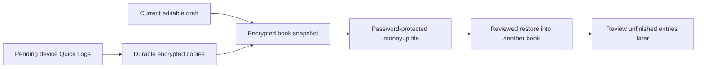

# Backup with unfinished Quick Logs

## Incident and cause

The owner's screenshot shows `pendingLockedCaptures` blocking backup. The
current released design exports the SQLCipher book, while locked Quick Logs
live in a separately encrypted device inbox. The backup entry point and the
screen both refused export while that inbox contained any captures. Review
also preserves an existing unfinished draft, so opening Review alone does not
necessarily advance the queue. The screenshot does not establish corruption
or identify the installed build.

## Candidate behavior

Backup preserves all readable pending captures as `pending_locked_captures`
records inside SQLCipher before streaming the existing authenticated archive.
The current editable draft is flushed separately. Nothing is posted to the
journal, and backup does not remove the device-inbox originals.

Stable source UUIDs deduplicate repeated backups and interrupted handoffs.
Persisted positions retain FIFO order even when the device clock moves back.
Conflicting copies, invalid envelopes, noncanonical physical IDs, and ambiguous
positions fail validation without deleting the source records. Restore retains
the archived queue inside the encrypted book; the normal review/save flow
consumes it one item at a time.

Replacing the current book still requires an empty current-book/device inbox.
The missing-key recovery transaction continues to recheck late **device**
input at its final boundary: pending entries inside the authenticated candidate
are part of that candidate, not new input from the old book.

No SQL table migration or encryption-format change is necessary: the existing
records table and archive already support named collections. Older builds
reject archives containing this new unknown collection during strict restore;
restore such archives with this candidate or a later compatible build. Existing
archives without the collection retain their current behavior. No downgrade,
installation reset, private-book access, or production release was performed.

## Validation

`PendingCaptureBackupTests` covers repeated backups with an existing income
draft and all four capture kinds, encrypted export and reviewed restore,
clock rollback/FIFO order, exactly-once journal save, failed destination writes,
interrupted inbox removal, conflicting copies, invalid payload/identity, and
ambiguous ordering. Existing backup expectations were updated to require
preservation while retaining the restore barrier.

Local candidate validation passed on 8 September 2026:

- 104 native app tests: 91 existing backup/capture/restore/draft/inventory tests,
  8 budget-recovery tests, and 5 new pending-capture backup tests; zero failures.
- 60 persistence tests; zero failures.
- Swift structure, architecture fitness, accessible errors, full release-asset
  validation (including security-boundary mutation checks), and `git diff --check`.
- Native toolchain: Xcode 27.0 beta (27A5252f), iOS 27.0 Simulator. Persistence
  tests used the native SwiftPM build system with a temporary scratch directory.
  The default SwiftPM build directory encountered a signing/extended-attribute
  error, so it was not used as passing evidence.

[Validation evidence](review-evidence/2026-09-08/backup-pending-captures-validation.txt)
contains the selected test summaries and artifact path. This is a local working
branch based on `ac2c6c5`; remote CI, signed TestFlight validation, and physical
owner-iPhone upgrade/export/recovery remain separate acceptance steps. No build
containing this fix has been uploaded or installed on the owner's iPhone.

## iCloud priority and delivery boundary

The current roadmap deferred CloudKit and the shipped entitlement file contains
only the application group. Automatic cloud backup is not an existing disabled
backend that can be enabled with a toggle. There is no committed delivery date.

Recommended next milestone: opt-in automatic encrypted backups and recovery on
a replacement iPhone, followed by multi-device live sync if requested. This
is a proposed change to the earlier local-only scope, not a claim that cloud
support has been implemented or enabled.

1. Complete this backup fix's signed and owner-device acceptance.
2. Implement an iCloud archive store with recoverable encryption-key handling,
   explicit opt-in, a last-successful-backup timestamp, multiple retained
   recovery points, and truthful pending/uploaded/error states.
3. Verify offline retry, quota exhaustion, interrupted uploads, account changes,
   and restoration on another iPhone. Preserve a known-good backup until its
   successor is confirmed usable.
4. Enable the Apple capability and validate the signed production configuration
   before distributing an iCloud-enabled beta.

The existing Files exporter can save a completed `.moneyup` archive to iCloud
Drive when that destination is available. This is manual export and requires
keeping the archive password; it is not automatic MoneyUp cloud backup.

Apple references: [document-picker import/export](https://developer.apple.com/library/archive/documentation/FileManagement/Conceptual/DocumentPickerProgrammingGuide/AccessingDocuments/AccessingDocuments.html),
[iCloud capability setup](https://help.apple.com/xcode/mac/current/en.lproj/dev52452c426.html),
and [Apple's private-database sync example](https://github.com/apple/sample-cloudkit-privatedb-sync).
