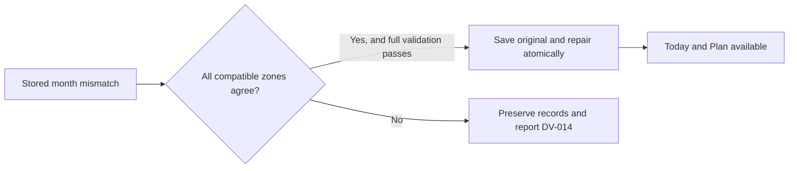

# DV-014 recovery and portable-backup access

The owner reports Today and Plan blocked by DV-014 in 0.7.1 (1042.1), with
one budget integrity record, and a nonresponsive portable-backup button while
locked Quick Logs are pending. Gift under Shopping and a top-level Others
category are present. Their presence is valid and is not evidence of corruption.
The private device record has not been inspected.

## Reproduced defect and repair

Earlier profile writes could change the reporting time zone without reanchoring
the budget configuration timeline. A September month-start instant written in
Singapore is August 31 in GMT. Validating that instant as a GMT month boundary
rejects the whole budget timeline. PR #53 made future zone changes atomic but
left already affected books blocked; retry, pin changes, and deleting categories
cannot correct these stored boundaries.

On normal load (including isolated restore-candidate migration), the new repair
runs only for `invalidMonthBoundary`. It finds the Gregorian zones in which
**every** stored revision is an exact month boundary. All compatible zones must
agree on every revision month, rollover activation month, and the current civil
month. It then uses the existing validated zone-change transformation once.

This is deliberately a bounded legacy repair. Arbitrary dates, conflicting
mixed-zone revisions, ambiguous activation months, changed financial
configurations, currency mismatches, and a change of the current civil month
remain unavailable. No revision is dropped or merged, no budget is invented,
and no old zone is chosen from device location or category names.

The repair commits these records in one SQLCipher transaction:

1. An encrypted original timeline, live budget nodes, and reporting-zone context
   under the reserved `budget_configuration_timelines/period-recovery-original-v1`
   record, which is included in portable backups.
2. Corrected live rollover activation anchors.
3. The corrected primary timeline, preserving revision IDs, financial settings,
   all currencies and monthly allocations, opening carry, and carry mappings.

Only after the transaction succeeds is repaired state published. Transactions,
origin-day attribution, accounts, profile, drafts, and receipts are unchanged.
Rollback recovery does not migrate or write the original snapshot. A second
inconsistency cannot overwrite the first recovery evidence. Restore validation
accepts exactly the reserved original ID and applies bounded history/node work
limits to it. No schema change or network operation is involved.

## Backup interaction

Create backup now responds with an accessible error for pending captures, a
short password, or mismatched passwords. The pending-capture notice offers
**Review pending Quick Logs**, which opens Log with the existing draft or the
next safely promoted capture. An existing income/transfer draft is preserved.
The underlying export gate still refuses an incomplete recovery point.

The final promoted capture is durably stored as the encrypted Quick Log draft
and included in the portable archive. It need not be committed as a transaction
to make a complete backup. Longer queues retain the existing sequential review
and save/discard behavior.

## Verification and limits

Core regressions cover Singapore/GMT in both directions, DST, the date line,
fractional-hour offsets, exact signed carry and mappings, original evidence
round trips, and strict rejection of malformed or ambiguous histories. The same
five regression methods pass with standalone Swift assertions on this Mac;
this is separate from native XCTest execution.

App regressions cover both screens after an in-place database load, unchanged
non-budget record bytes and drafts, reopen idempotence, archived recovery
evidence, malformed-history quarantine, rollback preservation, cancellation,
failed-store recovery, Gift/Others hierarchy operations, existing-draft safety,
and backup after promoting the last locked capture. The iOS 26 review workflow
includes this regression class.

Native XCTest and simulator evidence must come from the exact candidate CI
because this Mac has Command Line Tools without XCTest/Xcode. Passing checks do
not establish that the owner's private record is in the supported legacy class,
or that their existing iPhone installation has been repaired. That requires an
in-place TestFlight upgrade and verification on the device; never uninstall as
part of this recovery.
