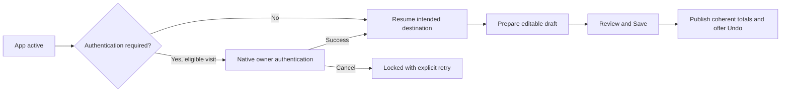

# Effortless MoneyUp journeys

Feature branch: `codex/effortless-moneyup-journeys`. Baseline:
`a7b987b045e0bfb4e16604c1e3c0a8b84408c621` (current origin/main at inspection).
No merge, signing, upload, distribution, or external service is authorized.

## Requirements and approach

The current user request authorizes implementation. The Golden contract,
`CHANGE_CONTROL_0.7.1_APPROVED_REWORK.md`, and approved
`BUDGET_REDESIGN_2026-09-05.md` retain authority over accounting, hierarchy,
privacy, navigation, and recovery. No schema or financial-policy redesign is
needed to remove the verified interaction gaps.

For each journey, identify its outcome, already-known context, and removable
steps. Preserve exact Decimal arithmetic, per-currency balance, user choices,
encrypted drafts, the five tabs, and bilingual accessible controls. Automated
preparation ends in an editable draft; only explicit Save posts money.

## Verified baseline and implementation increments

| Journey | Source-backed baseline | Increment |
|---|---|---|
| Authentication | Cold start reads the protected key automatically, but a locked foreground return only clears the cover. Existing startup guard prevents simultaneous starts. Keychain/SQLCipher opening is detached; shields cover sheets and accessibility. | One automatic attempt per eligible visit; native-prompt inactivity does not rearm; cancellation permits explicit retry; manual Lock suppresses the current visit. Keep locked capture available. |
| Fresh logging | Amount focus, currency label, device-local capture calendar, preserved timestamps/drafts, decimal string input, keyboard Save/Done, exact split helpers, save acknowledgement and Undo already exist. The six-second acknowledgement replaces the bottom Save control. | Keep Save available during feedback; make Notes directly reachable from the keyboard. |
| Receipt preparation | Selection already runs Vision and presents candidate review. Baseline equality protects edits during recognition, but can overwrite populated fields entered before selection. | Prefill untouched fields only; preserve manual values, dates, account/category choices and edits during recognition. Explicit candidate selection remains available. |
| Duplicate review | Save checks only `model.entries`, a bounded recent cache in production, despite arbitrary entry dates. | Check the complete indexed time window with bounded memory and cancellation/book-revision validation. |
| Navigation | Native Back/Close, labeled filters/reset, exact chart presets, removed global swipe, durable token-bound widget ingress, and unfinished-draft confirmation already exist. | Preserve these contracts; inspect contextual Repeat/Refund preparation. |
| Planning and totals | Automatic parent allocations and legacy fixed caps, standalone categories, atomic lifecycle changes, explainable minor-unit/calendar-based Flexible today, per-category guidance, and coherent widget invalidation/publication already exist. | Add targeted regression evidence; change only reproducible remaining gaps. |
| Other journeys | Onboarding, accounts, assets, settings, and recovery require targeted inspection. | Prefer small demonstrable corrections over new screens, services, or settings. |

## Evidence boundaries

Local environment: macOS arm64, Swift 6.4 Command Line Tools; no full Xcode.
Run local validators and executable probes, then native app/core tests and the
existing deterministic 10,000-entry / 20-schedule Release Simulator harness on
the exact feature-branch source. Record tap paths separately from actual user
measurements. Physical biometric/passcode, interruption, keyboard occlusion,
VoiceOver, travel, upgrade/restore and device performance require device evidence;
source inspection or Simulator success must not be reported as those passes.

## Implemented preparation and navigation increment

- Existing receipt values and explicit choices are protected before recognition;
  edits during recognition add field protection even if text returns to its
  earlier value. Candidate buttons remain explicit replacement actions.
- Notes is one keyboard action away. Bottom Save remains present during the
  acknowledgement/Undo interval; account creation opens directly from blocked
  Log states. Search stays exposed in History's navigation drawer.
- Duplicate review scans 200-row encrypted pages across the inclusive 24-hour
  window on each side and, when present, the indexed source fingerprint. Ranking
  still uses the existing exact-money detector. Only the strongest match stays
  in memory. Draft/book/projection changes invalidate the response; lookup
  failures preserve the draft and request retry.
- History's leading swipe/context menu offers Repeat and expense Refund for
  supported active ordinary accounts. Preparation verifies the source still
  exists unchanged, checks exact replacement consent, persists the draft, and
  opens Log. It never copies posting/replay/receipt ownership or posts money.
  Archived/protected/restricted sources require their established review path.
- Today prioritizes the earliest unresolved active recurrence, including overdue
  items, and opens its Calendar date for explicit Post/Match/Skip. No notification
  permissions, background service, or automatic financial posting was introduced.
- Onboarding opening-balance timestamps and month-to-date comparison use the
  injected user-action clock. Parent/subcategory financial rules are unchanged.

The architecture validator hashes for the three changed Quick Log extensions
were refreshed after inspecting their new input protection and UI wiring. The
Foundation Models input/output, availability, cancellation, and mutation tests
remain enabled; no model authority or network boundary changed.
