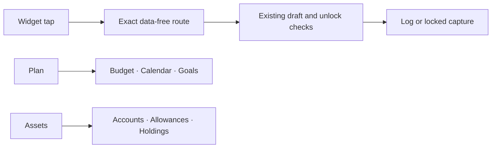

# MoneyUp 0.7.1 — build 1039.1 feedback

## Implemented behavior

| Feedback | Result |
|---|---|
| Unhelpful widgets | Disabled or expired summaries fall back to the configured logging action, with four actions on a standard medium widget. Current summaries still use the existing bounded snapshot. |
| Widget tap crash | Home and Lock Screen logging now uses WidgetKit `Link` and `widgetURL` with the existing six exact routes. Shortcuts and Control Center retain their intent path. This removes intent execution from ordinary widget navigation; the reported crash is not confirmed fixed without the device report or reproduction. |
| History and Plan selectors | One explicit horizontal chip contains the current icon and label; peers remain icon-only. Minimum targets are 44 points. Narrow layouts and accessibility text use a named menu. |
| Obscured titles | Plan uses a bounded header in normal layout, with no material extending into its title. Main screens share an opaque inline navigation surface. Today’s hero sizes from its content; artwork and decoration cannot intercept controls. |
| Budget | Remaining money and pace lead, composition and simulator sit together, and children expand on demand. Month, currency, pace, and calendar date survive peer-section navigation. Large text gets a menu for pacing. |
| Allowances | Current allowances and benefits appear beside accounts in Assets, with add/manage routes. Prepaid setup can create its missing account without losing the allowance draft. Benefits and reimbursements do not become cash or net worth. |
| Confusing interactions | History groups its controls, exposes Filter and Clear filters, and resets search with filters. Empty results have a reset action. Keyboard dismissal is consistent across scrolling editors and tab switches. Changed transaction, account, holding, schedule, allowance, goal, and loan sheets require an explicit discard; reappearing editors preserve input. |
| Visual polish | Shared horizontal controls, quiet card borders, stable titles, bounded illustrations, budget graphics, interactive composition, and an adjacent what-if simulator work with existing semantic colors and Reduce Motion. |

## Validation and limits

- Source checks cover Swift structure, architecture, launch safety, accessible errors, localization, private platform routes, and release assets. The platform validator still rejects payload-bearing URLs and new unreviewed entry points; the App Group snapshot and encrypted ledger formats are unchanged.
- Regression tests check selected-chip geometry under an inherited icon-only label style, small-phone scope height, useful widget fallbacks and rejection of URL payloads, and actual UIKit swipe-dismissal protection for clean, dirty, and saving sheets.
- CI builds the app and widget and runs the full iOS 18 app-model suite, domain suites, and serial performance baseline. A separate iOS 26 job exercises navigation/platform routes and renders native review images.
- Native render coverage includes Today, History, Budget, Calendar, Assets, category management, composition, small-width Chinese Budget, and accessibility text in History/Budget/Display Settings. Rendered fixtures contain synthetic data.
- This Mac has Command Line Tools but no full Xcode/XCTest runtime, so local Swift parsing and source checks are supplemented by CI-native builds and tests. Native results and visual findings are recorded below.
- Device crash reproduction, VoiceOver walkthroughs, physical keyboard/gesture checks, and a signed TestFlight binary remain separate from Simulator evidence. No TestFlight upload or release is performed by this change.

## Evidence

Implementation commit: `953f712463a3c79466cb3493a1d13c87384e99c4`.

- [CI 34006939953](https://github.com/LaiWenKang/MoneyUp/actions/runs/34006939953): all four jobs passed — source/release assets, domain tests, iOS 18.5 app/widget build and **592 app-model tests**, and the serial Release performance baseline.
- [iOS 26 interaction review 34006939947](https://github.com/LaiWenKang/MoneyUp/actions/runs/34006939947): **68 passed, 0 failed, 0 skipped**, on iPhone 17 Pro / iOS 26.5, built with Xcode 26.6. The native artifact contains 12 screenshots and a machine-readable summary.
- The dismissal regression uses a real SwiftUI `.sheet` and verifies UIKit's effective dismissal policy after presentation completes. It checks both `isModalInPresentation` and the presentation delegate. Clean, edited, and saving states all pass. The first UIKit-only harness was corrected after its overlapping presentations were detected; its failed run is not passing evidence.
- Visual review confirmed unobscured Calendar titles, horizontal selected chips, rounded History filters, visible labels on collapsed Today cards, allowances under Assets, and readable English/Chinese and accessibility layouts. Screens are UIHostingController roots with synthetic data, not full-device screenshots; the global tab bar is outside these render fixtures.
- Review fixtures use the app's shared reporting instant and persisted language preference as well as SwiftUI's locale, avoiding misleading pace markers and mixed-language formatted copy.
- The final documentation commit records these results without changing app, widget, test, or build inputs. Physical-device crash reproduction and signed-binary validation remain open.

The navigation change follows Apple’s [WidgetKit scene-linking guidance](https://developer.apple.com/documentation/widgetkit/linking-to-specific-app-scenes-from-your-widget-or-live-activity). Header containment follows SwiftUI’s [safe-area behavior](https://developer.apple.com/documentation/swiftui/view/background(_:ignoressafeareaedges:)).
