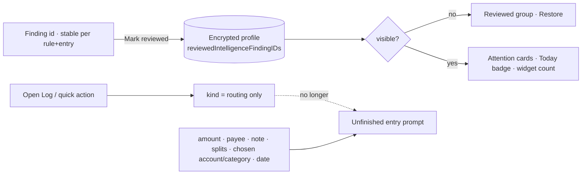

# MoneyUp 0.7.2 — build 1059.1 feedback

## Implemented behavior

| Feedback | Result |
|---|---|
| Private insights cannot be cleared after reviewing | Every finding has **Mark reviewed**; the related-transactions sheet gains the same action beside Done; adding a schedule from a finding marks it reviewed even if the amount was adjusted. Reviewed findings move to a collapsed **Reviewed** group with per-item **Restore**; the toolbar menu offers **Mark all reviewed**. Reviewed keys persist in the encrypted profile (bounded to 400, newest kept), so the same finding stays quiet across refreshes, relaunches, backups and toggling insights off/on. Detector identifiers for recurring, lapsed and price findings are keyed on the newest payment, so a reviewed subscription would have resurfaced after every charge; reviews therefore key on the series (and, for price increases, the stepped amount, so a further increase is shown again). Widget and Today counts exclude reviewed findings. |
| Every visit to Log becomes an "unfinished entry" | Two causes. History announced an unfinished entry whenever *any* draft record existed, and a draft record exists as soon as Log has been opened once. Separately, every quick action and every Expense/Income/Transfer/Refund tap recorded the kind as a manual field, which alone made the blank form count as user input. Kind is now treated as routing (like the retained account/category defaults); History, the Repeat/Refund replace prompt, and the widget-launch prompt all key off real user input. |
| Unfinished entry still shown after clearing (second report) | Third cause, and the one that made it permanent: promoting a widget capture made while locked into Log bailed out whenever *any* Quick Log draft record existed, which is always once Log has been opened. The capture stayed in the inbox forever, History kept announcing it, and *Review pending Quick Logs* silently did nothing. A blank routing draft now yields to the capture (real input is still never replaced), so unlocking after a widget capture opens Log with it filled in and no review step, as requested. History's section becomes a titled card with *Open in Log* and a confirmed *Discard captures*. |
| Log tab, smart entry and suggestions | Recent entries are one-tap capsules under the amount (long press picks single fields) instead of a card with a disclosure and a paragraph. Smart entry is one row: sparkles glyph, the field, and a fill arrow that appears only when there is text, otherwise the receipt-scan glyph; the explanation moves behind the explainer glyph. The suggestion card drops its paragraph. |
| Visual-first, low-cognitive-load pass | One shared state language (`MoneyUpStatePlaceholder`, `MoneyUpLoadingPlaceholder`): symbol badge, one title, one line, at most one action, applied to Plan, Goals, Loans, Allowances, Exchange rates, Assets detail, History filters, Calendar, pin editor, simulator and budget suggestions. Today's insights row joins the card system with a check glyph and "All clear". Calendar and History daily-flow charts are now two labeled same-scale bars instead of an axis chart that collapsed at small heights. The Assets multi-currency explanation and the Smart Entry paragraph move behind the existing explainer glyph / into the field placeholder. Every Settings row now carries a glyph (language, currency, insights, on-device matching, privacy, auto-lock, locked capture) so the screen scans by shape. Reports sizes the category chart per category instead of stretching one category into a slab. The first-backup warning gains a title and the shared warning shape. All copy remains bilingual. |

## Third pass (currency, History chrome, section headers)

See [UX audit and elevation plan](UX_AUDIT_2026-09-22.md) for the Log currency control and conversion sheet, the History scope-row filter chips, the header-line explainers, the prioritized backlog, and engineering items found on the way. The Apple platform skill library is vendored for the assistant under `.claude/skills/apple/` (see [Apple skills](APPLE_SKILLS.md)).

## Release notes

In-app What's New (0.7.2) leads with the Log and insights changes; `docs/TESTFLIGHT_WHATS_NEW.json` and `docs/app-store/0.7.2/release.json` carry the same two sentences in English and Chinese for TestFlight test notes and the public What's New.

## Crash, hang and purchase review

- Support tiers: the StoreKit configuration, the app's product identifiers and Apple's price receipt agree on S$1 (coffee), S$5 (dinner) and S$10 (boost) with Singapore as the base storefront. Other storefronts follow Apple's price equalization. The receipt also records that the Paid Apps Agreement is not yet accepted; until the Account Holder accepts it, live purchases cannot complete.
- Static audit of App and package sources: no `try!`, `as!`, `assert`, semaphores, `DispatchQueue.main.sync`, `Thread.sleep` or unbounded loops on the main thread. The two `fatalError` sites are the conventional unavailable `init(coder:)`. Preconditions guard constants. The seven force-unwraps are fixed GMT time zones, A–Z scalar construction and non-empty buffer base addresses. Every `[0]` access sits behind a count or non-empty guard. Every `while true` is a SQLite step loop that exits on done/error. Every checked continuation is a serializer with release on success and failure paths or a scanner/sign-in with single-resume state.
- Dynamic: Debug build installed and cold-launched on the iOS 27.0 simulator stayed in the foreground for 30 seconds with no crash report; the cold Smart Overview UI test (`MoneyUpColdLaunch` scheme) passed. The launch-safety validator (Keychain and SQLCipher off the main thread, watchdog) passes.
- Known local-only issue: the StoreKit purchase test waits indefinitely on this simulator's StoreKit daemon and was skipped in full runs; it exercises no code touched here.

## Validation and limits

- Source validators: Swift structure, architecture fitness (the reviewed `UserProfile.init` / `init(from:)` digests were deliberately recomputed for the new bounded field), launch safety, accessible errors, platform actions, performance signposts and release assets (bilingual keys) all pass on this tree.
- New regression tests: profile round-trip/legacy decode/bound for reviewed identifiers (Core); reviewed finding hidden across refresh, still hidden after the next occurrence changes the detector id, persisted, honored by a relaunched model, restorable, and mark-all (app model); kind-only manual field is not an unfinished entry and History's section visibility policy (app model); render evidence for reviewed/all-reviewed insights in light, dark and accessibility text, Today's quiet row, History without the false banner, Calendar flow bars and every converted empty state.
- The shared placeholder groups badge and copy into one VoiceOver element and leaves its action as a separate element; charts stay decorative because exact amounts are listed beside them.
- Local runs used Xcode 27.0 with an iOS 27.0 simulator; CI still pins Xcode 16.4 / iOS 18.5 and must be the acceptance run. Rendered screens are hosting-controller roots with synthetic data, not device screenshots. VoiceOver walkthroughs and physical-device checks remain open. No TestFlight upload or App Store change is performed by this change.

## Evidence

Local workspace, Xcode 27.0 (27A266a), iOS 27.0 simulator, 2026-09-21/22. Working tree, not a merged commit.

- Package suites: **487 XCTest cases** across Core, Persistence and Intelligence plus **53 Swift Testing cases** passed (`swift test --parallel`).
- App suite: **759** MoneyUpTests cases on the simulator with `DeveloperSupportTests` skipped. Two earlier full runs passed 758/758; the final run on the finished tree reported three window-dependent failures (keyboard focus and preload visibility) while a system Apple-Account dialog from a manual cold-launch check was occupying the simulator foreground, and all three passed when rerun alone immediately afterwards (4/4); that pre-existing StoreKit purchase test waited indefinitely on the simulator's StoreKit daemon and is unrelated to this change (no StoreKit source touched). Targeted overlapping runs of the intelligence, preparation, draft-clearing, 1039-regression, design-primitive, navigation and render classes passed 20, 38 and 6 cases; those overlap the full run and are not additional unique tests.
- Validator unit tests: 125 passed (`Scripts/tests`, signpost and platform validators included). All seven source validators pass.
- Rendered review images are in [`review-evidence/2026-09-21/feedback-1059`](review-evidence/2026-09-21/feedback-1059/): finding cards with **Mark reviewed** (light/dark), the all-reviewed state with the collapsed **Reviewed 1** group, accessibility-size layout, Today's quiet insights row, History with a routing-only draft and no unfinished banner, Calendar daily flow bars, Log smart-entry copy, and the Goals, Loans, Allowances and Exchange-rates empty states, plus audit renders of Settings with row glyphs, Reports with the per-category chart, Backup and recovery with the titled warning, the transaction editor and onboarding.
