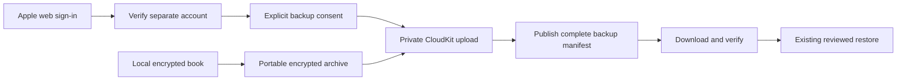

# Separate-account iCloud backup

## Authorized direction

The owner approved connecting an Apple Account for MoneyUp backups independently
of the iPhone's system iCloud account. This supersedes the earlier local-only
scope for this optional feature. Local operation, financial correctness,
draft preservation, encryption, and reviewed transactional restore remain
requirements. No production release or private-book upload is implied.

## Architecture and acceptance

1. Use CloudKit Web Services in the private database. Native CloudKit cannot
   select a different account from the device account.
2. Use an ephemeral Apple-hosted `ASWebAuthenticationSession` and a verified
   associated HTTPS callback. Credentials never enter a MoneyUp form. Accept
   callbacks only through the active session; verify the returned CloudKit
   user before enabling any transfer.
3. Store the rotating web token in device-only Keychain storage. Bind the
   connection to the container, environment, and verified remote user. An
   account change requires a new explicit backup decision. Expired sessions
   pause backup and request reconnection; they do not change the device account.
4. Create the existing password-protected `.moneyup` archive, including pending
   captures. Remember the independent recovery password only in the local
   Keychain after the user explicitly enables backup. A replacement device
   needs that password to restore; Apple sign-in alone does not recover it.
5. Upload bounded chunks because the documented Web Services asset endpoint
   limits uploads to 15 MB. Publish a versioned manifest only after all chunks
   have been acknowledged. Never overwrite the previous recovery point.
6. Download and verify every chunk and the complete archive, then use the
   existing restore-preview ticket and transactional replacement. No automatic
   cloud-to-local replacement or cross-account merging.
7. Automatic work runs while the app is active/unlocked and retries later when
   the network or session is unavailable. Show pending, uploading, last
   successful backup, reconnect, and failure states honestly. A background
   deadline is not guaranteed. Opt-out immediately stops new transfers.
8. Test cancellation, token rotation, session expiry, account mismatch, redirects,
   archive corruption, interrupted upload, duplicate retry, and offline mode.

## Current provisioning evidence

- The owner approved Apple setup on 8 September 2026. Container
  `iCloud.com.laiwenkang.MoneyUp` is registered under team `3ZPDTY7ZRS` and
  associated with MoneyUp. The App ID has iCloud/CloudKit and Associated Domains
  enabled; its existing App Group is preserved and the widget is unchanged.
- Apple validated and imported the development schema. Both backup record
  types, fields, query/sort indexes, and creator read/write permissions were
  inspected. The built-in Users schema remains present.
- The development API token has the exact HTTPS callback and only its origin
  allowed. User discoverability is off. No management token or server key was
  created; `cktool` management access remains unconfigured.
- The owner confirmed there is no existing domain and approved free Cloudflare
  Pages hosting. The static site is now deployed and its HTTPS return address
  is verified at `https://moneyup-signin.pages.dev/auth/icloud/callback`.
- A live `users/current` request with the approved Origin returns Apple's
  `421 AUTHENTICATION_REQUIRED` and an `idmsa.apple.com` sign-in URL. Omitting
  Origin returns `401 AUTHENTICATION_FAILED`. The client now sends the required
  origin on API requests; asset requests retain their independent signed URLs.
- Live separate-account authentication, signed-device callback acceptance,
  encrypted recovery, and production provisioning remain outstanding.

Source and simulated HTTP tests cannot establish that account B authentication
works on a phone using account A. The feature must remain unavailable in
unconfigured builds until the live acceptance evidence exists.

## Apple references

- [Web authentication and token rotation](https://developer.apple.com/library/archive/documentation/DataManagement/Conceptual/CloudKitWebServicesReference/SettingUpWebServices.html)
- [Associated HTTPS authentication callbacks](https://developer.apple.com/documentation/authenticationservices/aswebauthenticationsession/callback/https%28host%3Apath%3A%29)
- [Asset upload protocol](https://developer.apple.com/library/archive/documentation/DataManagement/Conceptual/CloudKitWebServicesReference/UploadAssets.html)
- [Record modification protocol](https://developer.apple.com/library/archive/documentation/DataManagement/Conceptual/CloudKitWebServicesReference/ModifyRecords.html)

## Implemented prototype and local validation

The working branch implements the account connection UI, ephemeral native web
sign-in adapter, closed private CloudKit wire protocol, per-account Keychain
session storage with response-header rotation, explicit recovery-password setup,
active/unlocked automatic backup, a durable chunked upload outbox, complete
manifest publication, paged history, confirmed deletion, download verification,
and the existing reviewed restore flow. Fresh onboarding can reach cloud restore.
The default build makes no cloud requests and exposes no unconfigured cloud button.

Upload outboxes are separated by account, book, and recovery-password context.
Changing the recovery password cannot relabel or resume an archive encrypted
with an earlier password. Atomic token/status updates preserve a later pause;
account switches do not inherit backup consent or recovery credentials. Local
erase cancels transfers and clears local cloud state before the erase marker is
completed, while completed remote backups require separate user deletion.

Validation on 8 September 2026:

- 127 native app tests passed: 100 existing backup/capture/restore/draft/inventory/
  erase cases, 8 budget-recovery cases, 5 pending-capture backup cases, 13 new
  cloud protocol/controller cases, and 1 native render case.
- The 14 cloud/render cases were rerun successfully after the final API and
  status refinements. These are included in the 127 unique tests above.
- 60 persistence tests passed. 57 architecture, 7 launch-safety, and 6 cloud
  configuration/accessibility Python tests passed.
- Full release-asset validation and `git diff --check` passed. Existing export
  APIs remain intact; a separate actor-isolated export-and-revision method
  supplies automatic-backup change tracking.
- A separate Xcode project was generated using synthetic development settings;
  its enable flag, environment, callback URL, and associated-domain entitlement
  were inspected during the initial implementation, before provisioning.
- Four native English/Chinese setup screens were rendered and visually reviewed.

After Apple provisioning, the 14 cloud/render tests passed again using the real
development bundle configuration, including origin enforcement in the simulated
protocol. XcodeGen's local include path was corrected to resolve from the repo
project root, and generation plus the compiled bundle settings were verified.
The ten cloud setup/hosting Python tests and live callback-host checks were
rerun. These checks neither sign into a private iCloud account nor upload a book.

[Native previews and evidence](review-evidence/2026-09-08/cloud-backup/README.md).

## Remaining live acceptance

The owner selected free Cloudflare Pages hosting and completed phone device
authorization. Hosting is deployed at `https://moneyup-signin.pages.dev`; live
HTTPS, exact association, callback routing, and privacy checks passed. Apple
Developer access and the live app ID prefix match the hosted association. The
approved development container, schema, capabilities, and web API token are
configured. See [Apple provisioning evidence](review-evidence/2026-09-08/cloud-backup/apple-development-verification.json)
and [hosting setup](../CloudKit/HOSTING.md). Future signed profiles need refreshing
after the capability change. The default keychain search found no usable signing
identity, so a signed device build has not been produced. Native HTTPS callback
interception, separate-account selection, real token expiry/reconnection, Apple
quota behavior, and physical replacement-device recovery remain unverified. Production App Store
privacy disclosures must also be reviewed for the optional cloud feature.
Neither this prototype nor the preceding manual-backup fix has been uploaded
to TestFlight in this work. The owner's installed app and private book have
not been accessed or changed.
