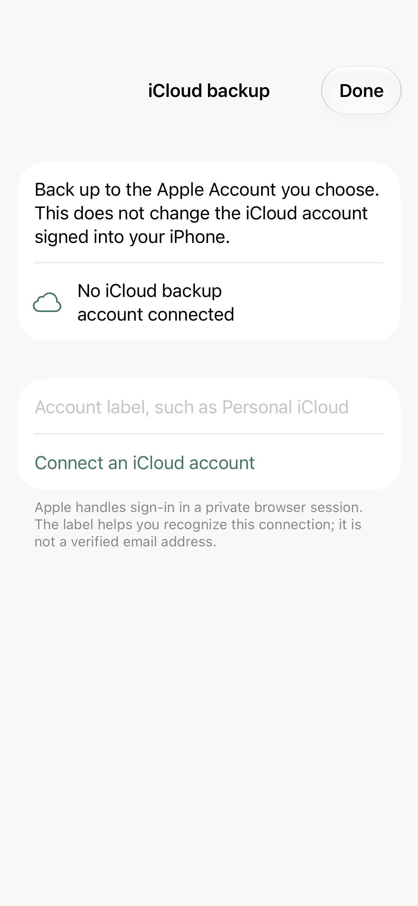
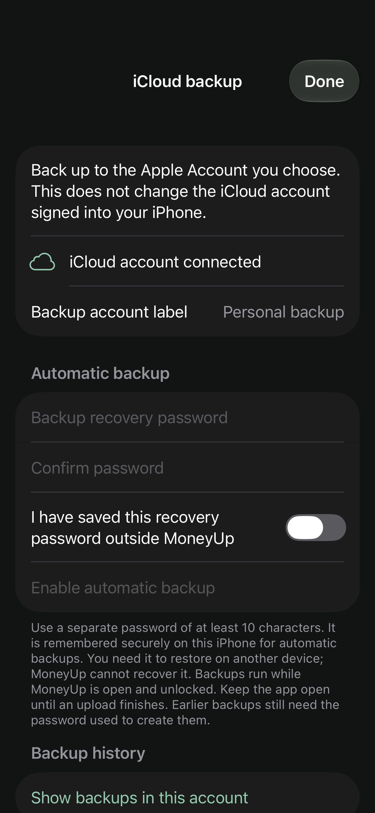
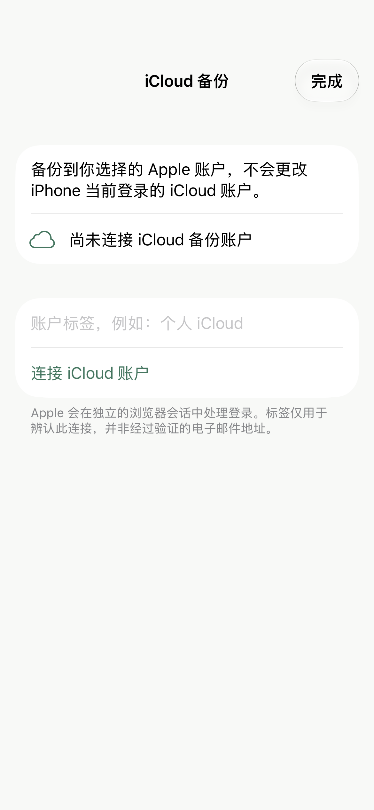
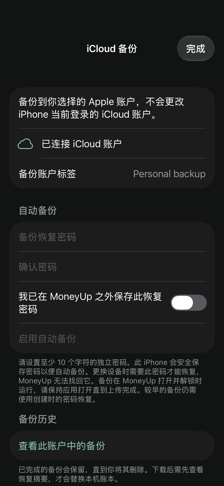

# Native cloud-backup prototype preview

These screens use fictional local fixtures. They do not show a live iCloud connection.
English and Simplified Chinese renders were inspected for wrapping, navigation,
password setup, and clear separation of connection from backup enablement.

[Validation details](validation.txt)

Apple development provisioning subsequently completed. See the separate
[live setup evidence](apple-development-verification.json) for saved capabilities,
schema, token restrictions, and the unauthenticated API check. The screenshots
below remain fictional previews; they are not device sign-in evidence.

## Connect — English

## Enable backup — English

## Connect — Simplified Chinese

## Enable backup — Simplified Chinese

