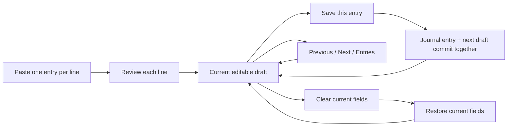

# Durable batch review and broad device validation

Source implementation: `135adbf45a26e93fc7736641450b72e20b70fcd2`, built on `fe15d50` and the earlier logging improvements. No public release or TestFlight upload is part of this change.

## Review flow



- Supports 2–32 draft lines. List numbering and bullets are removed without consuming decimal or negative amounts. Semicolon descriptions remain attached to their own line.
- An explicit multiline `split` remains one transaction in normal Smart Entry. Choosing **Review each line** is an explicit decision to treat the lines separately; a line may itself contain a complete split or transfer.
- An unfinished manual entry must be saved or cleared before creating a batch. The existing entry is never silently replaced.
- Each item uses the existing Log editor, validation, duplicate review and explicit Save action. Mixed expenses, refunds and foreign transfers retain independent amounts, currencies, notes and dates.
- Previous, Next and the Entries menu navigate unsaved items. Save posts only the selected item and opens another remaining draft. Removing a draft requires confirmation and leaves saved transactions and peers unchanged.
- The queue is one bounded encrypted draft record. Each nested item is local to that queue; item Clear recovery contains no queue snapshot. Restoring a cleared item therefore cannot resurrect a sibling already saved or removed.
- A batch/item/revision token authorizes advancement. Stale Save tokens and stale form callbacks fail instead of replaying a consumed item. Journal writes without a batch token preserve the queue.
- The journal entry, attachments and next queue state share one SQLCipher transaction. Reopening the store at the post-commit/pre-publication checkpoint sees both the saved entry and the advanced queue.
- References in queued drafts prevent account/category archive, deletion or merge from invalidating their financial routing. Activation revalidates account/category identities.
- Binary evidence remains entry-scoped: save or remove current attachments before switching drafts. Draft fields and Clear recovery survive encrypted backup/restore; transient attachment limitations remain unchanged.

## Focused regression evidence

The new tests cover numbered/mixed-language lists, descriptions on separate entries, explicit split versus batch choice, queue bounds, stale tokens, out-of-order review, item-local Clear recovery, store reopen at the commit boundary, unrelated journal writes, encrypted backup/restore, removal scope, lifecycle references and failed queue writes.

Verified on the implementation SHA:

| Gate | Observed result |
|---|---|
| Local package | 514 passed (461 XCTest + 53 Swift Testing) |
| Architecture validator tests | 57 passed |
| Focused batch and device test | 8 passed |
| iOS 18.5 app model tests | 715 passed |
| iOS 18.5 Release performance | 11 passed |
| iOS 26 interaction review | 148 passed; cold-launch workflow also passed |
| iOS 27 simulator matrix | 37/37 passed: 31 iPhone and 6 iPad compatibility profiles |
| Static/release gates | Passed |

[Machine-readable checks](checks.json), [device matrix](DEVICE_MATRIX.md), [raw matrix](device-matrix.json), [binary provenance](provenance.json). All disposable devices were removed after evidence export; no existing device was erased.

## Phrase coverage

The repeatable corpus now has 64 targeted fixtures. Sixteen new batch-description cases expose a previous ambiguity: text after the first semicolon could absorb later transaction lines. These inputs are now flagged for separate review before single-entry interpretation.

The remaining additions exercise realistic SGD/MYR/USD/EUR wording, mixed Chinese/English merchant/account names, refunds, salary, explicit totals and relative dates. This is targeted regression coverage, not a population accuracy estimate.

The benchmark uses the same interpreter API in both revisions when available. Reproduce with a checkout of `fe15d50`:

```sh
python3 Scripts/benchmarks/run_logging.py --baseline /tmp/moneyup-batch-baseline --output /tmp/moneyup-batch-benchmark --runs 3
```

## Device coverage and scope

“All” is implemented as all 31 iPhone profiles supported by the installed iOS 27 simulator runtime, plus six configured iPad compatibility profiles. Disposable devices are created only for this test and deleted after evidence export; existing simulators and installations remain intact.

The device case renders English, Chinese and accessibility text on that simulator's actual scene bounds, then saves one synthetic entry and verifies that exactly two drafts remain. Save duration is an observation on shared virtual hardware, not a physical-phone benchmark. iPad runs check compatibility; MoneyUp remains an iPhone-targeted application.

Run the matrix from built test products:

```sh
xcodebuild -project MoneyUp.xcodeproj -scheme MoneyUp -configuration Debug -destination 'generic/platform=iOS Simulator' -derivedDataPath /tmp/moneyup-batch-native -testProductsPath /tmp/moneyup-batch-products.xctestproducts CODE_SIGNING_ALLOWED=NO build-for-testing
python3 Scripts/benchmarks/run_batch_device_matrix.py --test-products /tmp/moneyup-batch-products.xctestproducts --output /tmp/moneyup-batch-device-matrix --workers 2 --configured-ipads
```

Supplemental CI uses the repository's pinned iOS 18.5 build/test configuration and iOS 26 interaction workflow. No physical phone is connected. Other iOS runtimes, physical touch/VoiceOver, battery, thermals and real-device latency remain unverified.

## Remote source checks

- [CI, including iOS 18.5](https://github.com/LaiWenKang/MoneyUp/actions/runs/34356967668)
- [iOS 26 interaction review](https://github.com/LaiWenKang/MoneyUp/actions/runs/34356967829)

Both remote workflows completed successfully on `135adbf`. These are source/simulator results, not physical-device or TestFlight installation evidence.

## Measured comparison with fe15d50

Three counterbalanced, unloaded repetitions; 100 interpretations per fixture per run. The interpreter and output-extraction harness are the same for both variants. The final measurement followed simulator cleanup.

| Metric | Before | After |
|---|---:|---:|
| Completely correct targeted fixtures | 48/64 | 64/64 |
| Field discrepancies requiring correction | 15 | 0 |
| Median interpretation + extraction | 0.750 ms | 0.695 ms |
| p95 interpretation + extraction | 2.524 ms | 2.502 ms |
| CPU per 6,400 interpretations | 6.087 s | 5.000 s |
| Process peak RSS | 11.17 MiB | 11.12 MiB |

Median latency improved 7.4% and CPU time improved 17.9%. Memory was effectively unchanged. Correction counts are a fixture-derived interaction proxy, not observed phone taps. The per-device save observations likewise describe simulator/model completion on shared host hardware.

[Comparison/source fingerprints](comparison.json), [all run metrics](benchmark-runs.json), [baseline cases](baseline-cases.json), [current cases](after-cases.json).

## Representative visual evidence

- Compact phone: [English](compact-english.png), [Chinese](compact-chinese.png), [accessibility text](compact-large-text.png).
- Standard phone: [English](standard-english.png), [Chinese](standard-chinese.png), [accessibility text](standard-large-text.png).
- iPad compatibility: [English](ipad-compatibility-english.png), [Chinese](ipad-compatibility-chinese.png), [accessibility text](ipad-compatibility-large-text.png).

All 37 profiles have exported screenshots, logs and summaries under `/tmp/moneyup-batch-device-matrix`. A passing model test is not a physical touch, VoiceOver or hardware performance claim.
