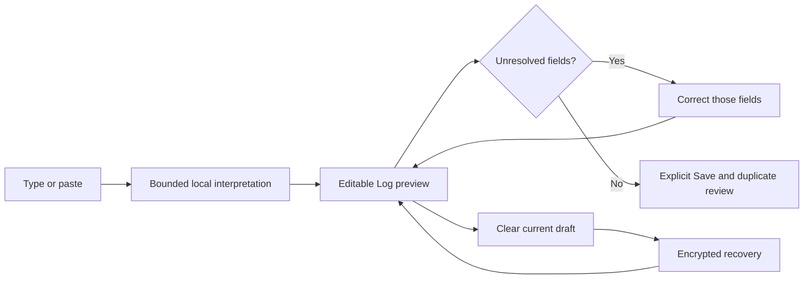

# MoneyUp logging flow: interpretation, review and recovery

Built on `4c2f7af` on `codex/smart-entry-log-improvements`. The previous Smart Entry placement, prominent title/description, quick manual amount entry, decimal protection and current-draft Clear remain in place.

## What changed and why

The remaining friction came from synchronous interpretation, missing transfer/split structure, arbitrary account-name tie breaking, missing field provenance and irreversible clearing. The implementation keeps one editable Log form and one existing ledger save path.



- **Understanding:** Added mixed-language name matching, explicit currency names, cleaner refund/income merchant extraction and richer relative dates. Existing fullwidth-digit and numeric-account support is preserved. `3 days ago`, `3天前`, `last monday`, `上周三` and `next friday` use Calendar arithmetic. Incomplete or conflicting dates remain unresolved.
- **Transfers:** directed `from … to …`, reversed `to … from …` and Chinese direction markers. A selected Transfer mode supplies explicit context; `20 to Bank` identifies the destination and asks for the source. Foreign transfers require a separately supplied received amount. Dates and descriptions apply to the whole transfer, including when written after the received amount.
- **Splits:** explicit `split` / `拆分` with named category lines, exact checked addition and declared-total reconciliation. Several numeric lines are flagged for separate review; they are never silently combined or posted in bulk.
- **Editable preview:** populated controls remain directly editable in Log. Unresolved fields block Save. Automatic-field provenance lets a revised phrase update its own suggestions while preserving manual corrections, including corrections chosen from receipts, history and on-device suggestions. The original phrase remains editable and follows Hide Amounts while unfocused.
- **Less work while typing:** interpretation runs in a cancellable background worker, with one serialized worker chain. Receipt selection, Clear, edits, navigation, lock and book replacement retire obsolete work. Publication verifies the exact draft, account snapshot and book revision. Merchant lookup waits for a 180 ms typing pause and avoids marked text.
- **Recovery:** Clear persists an encrypted, bounded copy of the current draft before publishing the cleared state. Restore refuses to overwrite a newer draft, survives lock/reopen and never changes journal entries. Transient attachments can be restored while the corresponding Log session remains available.
- **Local learning control:** the existing confirmed-entry merchant/category index remains the source of suggestions. The Smart Entry options menu can disable its use without deleting saved transactions. Amounts and dates are never learned as defaults for new entries.
- **Input safety:** provisional Chinese text cannot trigger Smart Fill or a transaction save; draft text remains preserved; normal typing retains focus and the original text. Successful Save resets per-entry content, review state and recovery. Existing duplicate/commit guards remain authoritative.

One old test required UUID-based selection between identically named accounts. That expectation was deliberately replaced with an ambiguity requirement; alphabetical or UUID order is not evidence of financial intent.

## Repeatable comparison

Baseline is the actual `4c2f7af` source. Both versions use the same 32 labelled, deliberately targeted fixtures, compiler settings and harness. Three counterbalanced runs per version, 100 repetitions per fixture per run; medians across runs are shown. Each interaction has an autorelease pool.

| Metric | Before | After |
|---|---:|---:|
| Completely correct targeted fixtures | 12/32 | 32/32 |
| Field discrepancies requiring correction | 31 | 0 |
| Median interpretation + extraction | 1.186 ms | 0.907 ms |
| p95 interpretation + extraction | 1.748 ms | 2.745 ms |
| CPU per 3,200 measured interpretations | 3.941 s | 3.721 s |
| Process peak RSS | 10.23 MiB | 11.00 MiB |

Median latency improved 23.5% and CPU use improved 5.6%. Tail latency increased because compound transfers/splits perform additional interpretation and checks; process peak memory increased 0.77 MiB. Parsing is off the typing thread. These measurements do not establish phone frame rate, battery use or end-to-end touch latency.

The correction count is a fixture-derived interaction proxy, **not measured taps**. Ambiguous fixtures intentionally require user input. 32/32 is coverage of these regression fixtures, not an estimate of accuracy on unrestricted language.

[Comparison and source fingerprints](comparison.json). Per-case expected/actual results and each run are in `baseline-1.json` through `baseline-3.json` and `after-1.json` through `after-3.json`.

To reproduce on macOS with Xcode selected, create or reuse a baseline checkout, then run:

```sh
git worktree add --detach /tmp/moneyup-log-baseline 4c2f7af
python3 Scripts/benchmarks/run_logging.py --baseline /tmp/moneyup-log-baseline --output /tmp/moneyup-log-benchmark --runs 3
```

The runner builds both checkouts before measuring. The standalone Swift harness is stored as a template to keep it outside the app's compiled-source inventory; it is copied into the chosen output directory for compilation.

## Validation and visual evidence

- Package: 509 tests (456 XCTest + 53 Swift Testing). Full serial UTC execution, with targeted transfer/context reruns; the final full package run passed.
- App: 71 selected native tests, including exact transfer/split drafts, automatic versus manual provenance, clear/reopen recovery, stale-restore refusal, obsolete parser cancellation, repeated Save, confirmed-entry learning control, duplicate review, pending captures, keyboard/Chinese marked text, localization and existing on-device assistance. [Native summary](native-summary.json).
- The render test additionally exercised actual unresolved-preview and clear-recovery states. [English](log-english.png), [Chinese](log-chinese.png), [large text](log-large-text.png), [editable preview](editable-preview.png), [clear recovery](clear-recovery.png).
- All 57 architecture-validator tests passed. Source structure, localization/release assets, platform actions, accessible errors, launch safety and performance-signpost checks passed. The architecture dependency/call inventories were reviewed and updated for the new local interpreter and field-provenance actions; existing adversarial checks remain enabled.
- Environment: Xcode 27 beta, iOS 27.0 iPhone 16 simulator; synthetic books only. The installed private book was not opened or modified.

Raw local results: `/tmp/moneyup-logging-handoff.xcresult`, `/tmp/moneyup-logging-privacy.xcresult`, `/tmp/moneyup-logging-core-delivered.log` and `/tmp/moneyup-logging-architecture-final-pass.log`.

## Limits and remaining device checks

- Multi-entry text is retained and flagged for separate review. Batch queueing/posting and unrestricted natural-language understanding are not implemented. Split syntax is explicit, not guessed from an arbitrary list of prices.
- Exact local account/category names are supported. Duplicate names require selection; unknown aliases and unsupported wording require correction in the form.
- Clear recovery covers draft fields across lock/reopen. Unsaved image/PDF bytes remain transient; after leaving the relevant session or locking, those attachments may need re-selection. Restore is available while the cleared form has not been replaced by new edits.
- Native marked-text tests use UIKit's composition APIs. Actual Chinese keyboard candidate panels, touch targets, VoiceOver, device timing, thermal behavior and in-place installation still need phone acceptance.
- No new TestFlight build was uploaded and no public release was made.

Apple API references: [marked text](https://developer.apple.com/documentation/uikit/uitextinput/markedtextrange), [Calendar](https://developer.apple.com/documentation/foundation/calendar), [task cancellation](https://developer.apple.com/documentation/swift/task/cancel()).
